# Timetable PWA — visual project audit

**Prepared 10 September 2026 · Implementation handoff for Claude**

The app has a useful foundation, but several screens ask users to read small text, interpret unexplained icons and scan controls of equal visual importance. The proposed direction is a calmer, more readable interface with clear next actions, labelled icons and purposeful colour. This is an audit and design package: **no application changes have been made**.

**Start here:** [Open the before-and-after gallery](designs/gallery.html). Each section below also embeds a side-by-side image. The left is an actual current-app screenshot; the right is a proposed HTML/CSS design. Open individual screens from the gallery to inspect them at full size. The gallery navigation works; the app controls inside the proposed pages are visual specifications, not implemented features.

## 1. What was reviewed

The baseline is commit `74de8bf` plus the working-tree state captured in [baseline.txt](evidence/baseline.txt). `src/lib/config.ts` was modified and `src/lib/cloudBackup/` was untracked work in progress. The earlier audit folder was also untracked. Those files were preserved; no assumption was made that the working tree was clean or that cloud backup was finished.

The review spans the learner app, admin analytics UI, navigation, shared controls/styles, reminders, storage/backup, sync, worker integration boundaries and the regression suite. Manual visual inspection focuses on Today, mobile/desktop Schedule, Session details, Travel & map, Journey home, Tasks, PGCE, Settings, Data & devices and the admin overview. Screens were also captured for Reminders and Find. Onboarding, populated specialist PGCE forms, error states and other admin tabs have existing automated coverage; this audit does not claim a manual review of every combination of their states.

All screenshots use synthetic records. Learner captures use Monday 7 September 2026 at 08:15 London time. Mobile captures are 390×900 and desktop captures 1440×900. Admin fixtures use the audit execution date and preserve the same headline values in the proposed view. No personal data or production services were queried.

### Verification results and limits

| Check | Result | Meaning |
|---|---|---|
| Unit suite | 153 passed | Existing logic regressions passed in the snapshot |
| Normal production build | **Failed** | TypeScript error in the in-progress cloud snapshot module |
| Vite-only visual bundle | Passed | Permits rendering; does **not** make the normal build pass |
| Browser tests against that visual bundle | 108 passed | 106 existing tests plus 2 audit capture tests |
| Current-screen horizontal overflow | 0px on the captured screens | Does not establish full accessibility compliance |
| Proposed-screen horizontal overflow | 0px at captured widths | See `designs/render-qa.json`; long pages still scroll vertically |
| Contrast sample | Existing overdue text 3.45:1 | Below the ordinary-text 4.5:1 target; details below |

Logs and the capture harness are in `evidence/`. An initial browser run had no valid build to serve and was stopped; its failures are retained separately and are not reported as app regressions. The successful browser result is `browser-visual-bundle-results.txt`. No claim of production readiness or live integration verification follows from the visual bundle.

### Read the comparisons fairly

The same session names, deadlines and admin counts are retained. Titles may be split into a short heading and a subtitle; the complete title must remain available. The proposed design moves the **routine backup nudge** into relevant data-health/backup entry points rather than placing it above every screen heading. That layout change is explicit; it is not evidence that a backup has been made. Actual pending-save failures must remain visible globally. Several proposed pages scroll beyond the first viewport; their bottom controls remain reachable with scroll padding.

The travel screenshot intentionally has no device fix and blocked map requests. Its proposed counterpart retains the unavailable-map state and does not invent a live route, travel duration or successful provider response. The existing fallback is working; the improvement is explanation and hierarchy.

## 2. Priorities

| ID | Priority | Finding | Change |
|---|---|---|---|
| V-01 | P1 | Dense 11–12px information is hard to read | Raise essential text sizes and reduce competing detail |
| V-02 | P1 | Overdue text fails the sampled normal-text contrast target | Replace legacy pink/orange text with semantic tokens |
| V-03 | P1 | Several controls are much smaller than the proposed touch target | Standardise shared interactive controls |
| V-04 | P2 | Repeated routine backup prompt displaces page identity | Contextual data-health prompt; retain global error alerts |
| V-05 | P2 | Small emoji-only and unlabeled controls require interpretation | Consistent line icons plus visible action labels |
| V-06 | P2 | Travel screens present mechanics before the next useful action | Origin → destination → status → action, then options |
| V-07 | P2 | Data & devices mixes health, attendance, backup and sync | Group by user decision; move detailed attendance reporting |
| V-08 | P2 | Admin source explanations compete with the metrics | Clear dataset labels and grouped explanatory detail |
| V-09 | P2 | Desktop overlaps produce narrow, tiny event labels | Readable density and explicit expansion of parallel sessions |
| V-10 | P2 | Important actions and statuses look equally prominent | One primary action per task, with quieter secondary actions |

These are UI findings, not ten independent functional regressions. P1 improvements should ship with core shared components; do not wait for the larger feature roadmap.

## 3. Before and after: Today

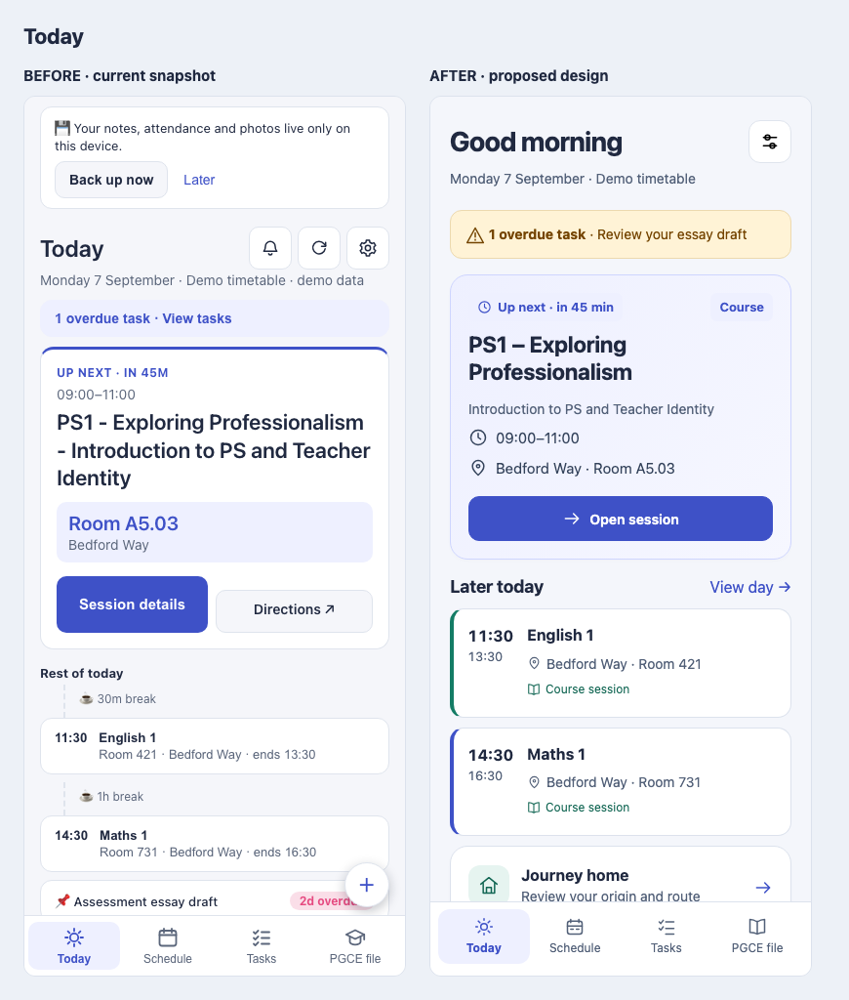

**Current:** the backup nudge sits above the page title; a long session title dominates; location has strong visual emphasis while time and later sessions are smaller. A floating plus competes with the bottom navigation and nearby content.

**Proposed:** a clear heading/date, one attention summary, then one next-session card. Time and room use recognisable labelled icons. The course title is split into title/subtitle without deleting its content. Later sessions become readable cards; Journey home is an explicit destination rather than a tiny auxiliary link.

**Implementation:** update `src/features/today/TodayPage.tsx`, the app's backup-nudge placement and the shared card/action components. Keep direct Directions available as a secondary hero action or labelled menu item; the concept's primary button must not force extra steps for every journey. Keep Add accessible through a labelled action or the existing FAB with tested spacing. The backup entry should retain an attention count in Settings/Data until addressed or explicitly snoozed; do not infer it was resolved from opening a screen.

**State contract:** before first session, current session, overlapping sessions, after last session and empty day must each have a clear next action. Attendance questions remain above the finished-day state when unanswered. Do not let a greeting replace the accessible page name “Today”. Retain the exact course clock. No mockup value implies a reminder was sent or saved data was backed up.

**Acceptance:** time/room/title readable at 390px and 200% text enlargement; overlapping sessions reachable; next action takes one tap; persistent errors visible; FAB and navigation do not cover the last actionable row.

## 4. Before and after: mobile Schedule

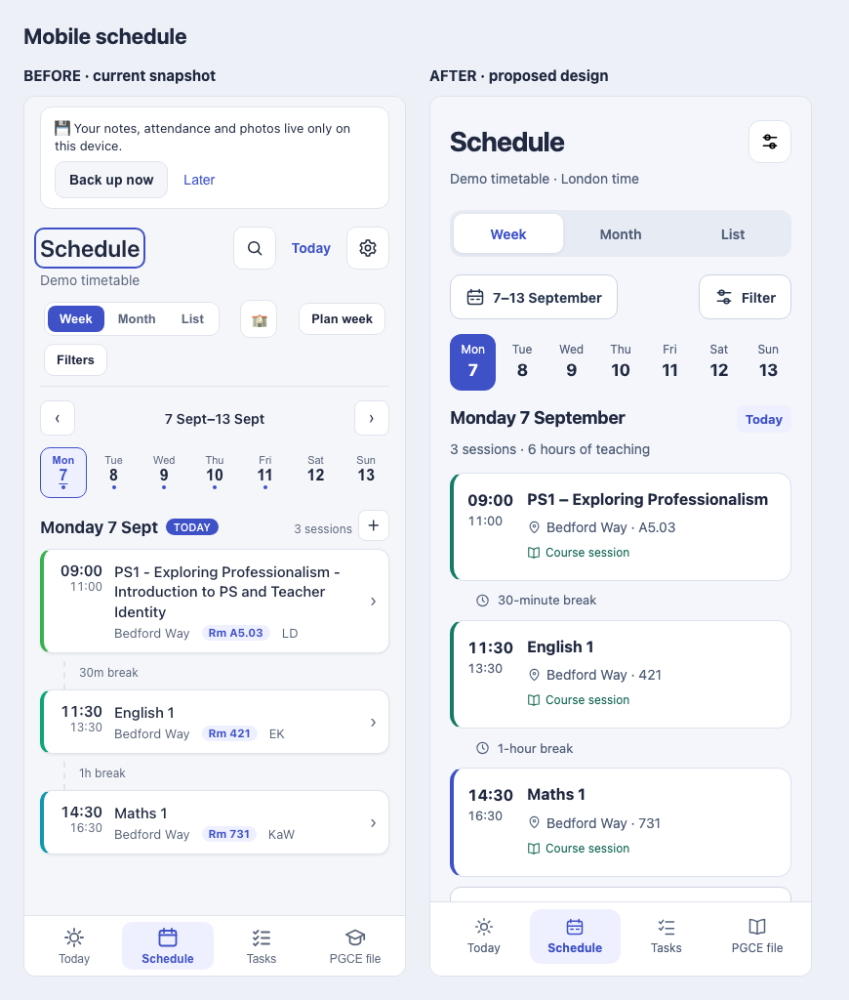

**Current:** Week/Month/List measure about 27px high in the captured state. The building emoji and dispersed controls add interpretation. The agenda is useful but the long title and small room metadata slow scanning.

**Proposed:** larger segmented controls, a clearly labelled week strip, separated day summary, and consistent time/title/location hierarchy. Breaks stay visually quiet. Colour supports session grouping; text still identifies the kind. The three two-hour sessions total **six hours**, not a workload estimate.

**Implementation:** `src/features/schedule/SchedulePage.tsx`, `WeekStrip.tsx`, `DayList.tsx`, `src/components/WeekView.tsx` and `src/index.css`. Retain Today, previous/next week, placements, filters, search, export and add-event access. Put secondary functions into a labelled More menu where necessary; do not remove them because a first-viewport mockup shows fewer controls. A full title opens in session details and remains in the accessible name. Date-strip buttons need selected-state semantics, keyboard operation and a full spoken date.

**Acceptance:** 320–440px widths, seven-day strip, weekend events, untimed deadlines, user commitments, no hidden filtered results, no duplicate owner records. Active filters have a count and a Clear action. All essential controls remain visible or deliberately grouped.

## 5. Before and after: desktop calendar

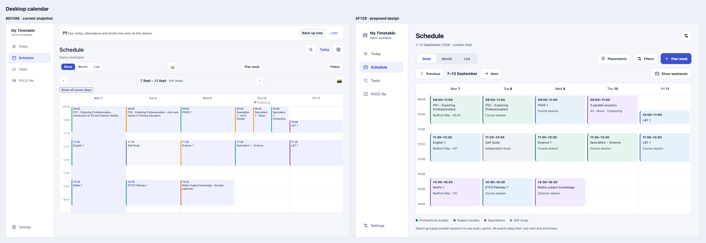

**Current:** available width is much better than earlier versions, but event text is still 11px in the measured grid. Three simultaneous specialisms are squeezed into narrow lanes. The calendar's actions are scattered across the toolbar.

**Proposed:** grouped view/actions and adjacent date navigation, a visual legend, 13px event text and clearer time ranges. Parallel events may display a **“3 parallel sessions”** group when the lanes would be unreadable; selecting it must expose all options in a panel. This grouping is an explicit interaction change, not permission to hide optional events. Existing room and subject details remain in the expanded view.

**Implementation:** preserve the existing overlap and time-positioning model. The concept now places half-hour starts at the correct vertical offset; do not copy a simplified evenly spaced CSS calendar into the app. Introduce a comfortable density of approximately 64–72px per hour and keep a compact alternative. Collapse lanes only below a measured minimum readable width, initially 100px. Do not group unrelated events or report them as a single session. Use source category labels rather than assuming a title's colour is its category. Colour labels in the mockup illustrate the palette; production mapping must follow canonical subject/type data.

**Acceptance:** three parallel events open three distinct records, count stays correct, 09:00/11:30/14:30 positions remain exact, notes retain ownership, keyboard reaches each item, selected date/filters survive opening and closing the panel. At 1024px allow an internal calendar scroll or readable list alternative; do not shrink all text to fit.

## 6. Before and after: session detail

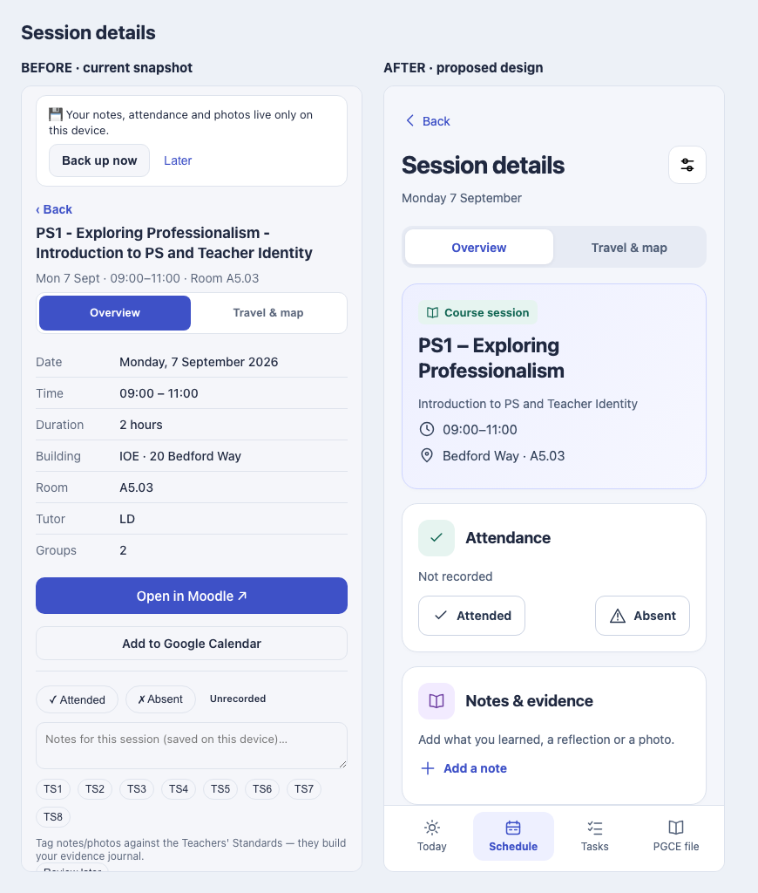

**Proposed structure:** identity and time/location first; attendance as one grouped choice; Notes & evidence as a distinct section; travel as a clear action/tab. Use line icons consistently. The Attended/Absent controls are 32px high in the current captured state; the proposed shared control minimum is 44px.

**Implementation:** update `SessionDetail` and shared controls without changing metadata semantics. Retain standards tagging, photos, notes, attendance reversal, personal-event edit/delete and the existing browser Back/return-route behaviour. The first viewport may summarise these sections, but expanding a section cannot be the only way to discover unsaved content or errors. Show saved/pending/failed accurately; no unconditional success checkmark.

**Acceptance:** explicit pressed/selected state for attendance, visible focus, keyboard tab order matching reading order, retained draft after interrupted editing, standards and attachment controls fully reachable. A user can reach travel without scrolling through an entire evidence form.

## 7. Before and after: travel to a session

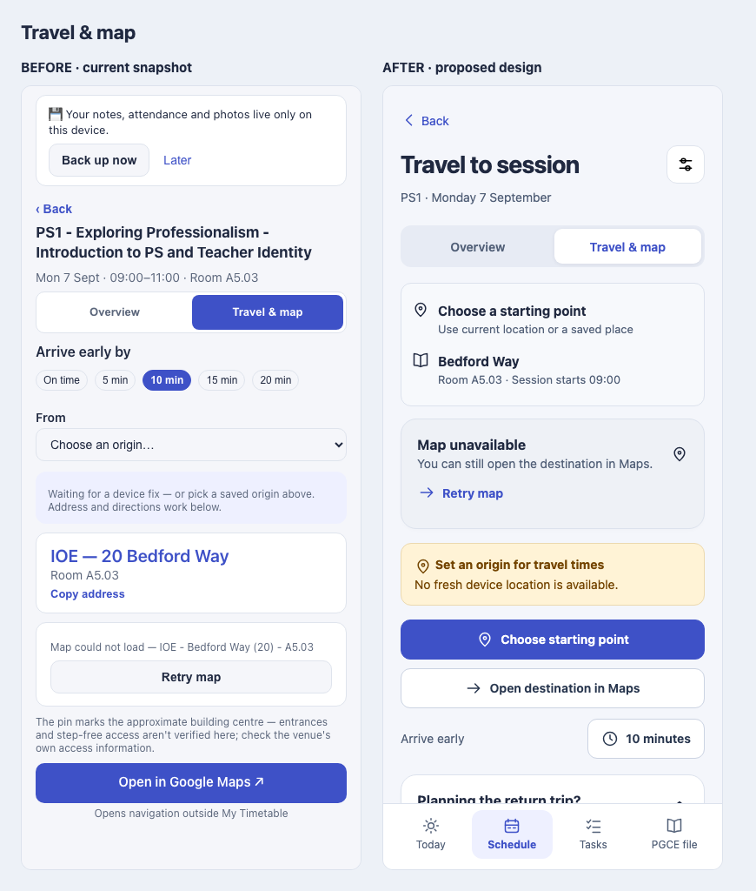

**Current:** “Arrive early by” comes before the origin, a waiting message uses small text, then address/map failure/provider actions. Users must infer which control unlocks a journey.

**Proposed:** show starting point and destination together, name the missing input, and make **Choose starting point** the primary action. Show a compact unavailable-map card with Retry and preserve external navigation. Arrival buffer is a secondary preference after the primary journey action. Home is explicitly a separate trip.

**Implementation:** reuse existing origin and journey state logic in `src/hooks/useJourney.ts`, `src/lib/origins.ts`, `src/components/SessionDetail.tsx` and associated travel/map components. Verify current filenames before editing. Keep origin selection as a real labelled native control or accessible picker; a decorative route panel is not sufficient. Do not request geolocation automatically as a side effect of reading a card. Show fresh/estimated/stale journey status as text plus colour. Map fallback must preserve address, Copy address, Retry and external navigation.

**State layout:** missing origin → origin action; loading → labelled pending state; route available → duration/leave time and navigation; stale → timestamp and refresh; no route/provider failure → address and provider fallback. A successful map state should give the map a 200–240px viewport on mobile with the address outside the image and provider attribution preserved. Never mark an approximate building pin as a verified entrance. A map must not capture scrolling unexpectedly.

**Acceptance:** each state reachable with fixtures, request failure never blanks the page, changing origin invalidates the previous journey, Copy address reports failure honestly, arrival-buffer changes replan, no fabricated live time. Capture an additional successful-route fixture during implementation; this audit's comparison deliberately shows the failed-map state.

## 8. Before and after: journey home

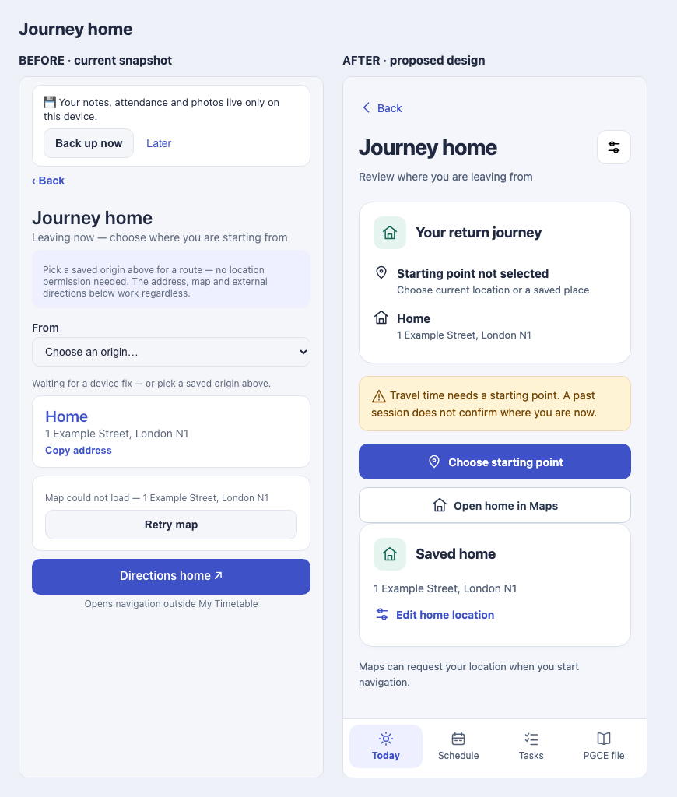

**Current:** origin instructions repeat and the only immediately obvious action is Directions home. Copy address measures around 15px high in the captured state.

**Proposed:** one origin/destination summary and one explanation. The starting point is explicitly unknown; home remains a saved destination. Choose starting point and Open home in Maps are distinct actions. Editing home is grouped with its saved address.

**Implementation:** `src/features/today/JourneyHomePage.tsx` and shared origin/map/action components. Retain Copy address and Retry map in the relevant detail group even though the concept gives them less prominence. Never infer the user's current location from the last session. For no saved home, show Set home and a clear return action. Hide precise home details in any export/share preview unless explicitly included.

**Acceptance:** no home, saved home/no origin, fresh device origin, denied location, stale location, no provider route and external maps launch. Back returns to the caller. No text implies routing succeeded merely because Maps opened.

## 9. Before and after: Tasks

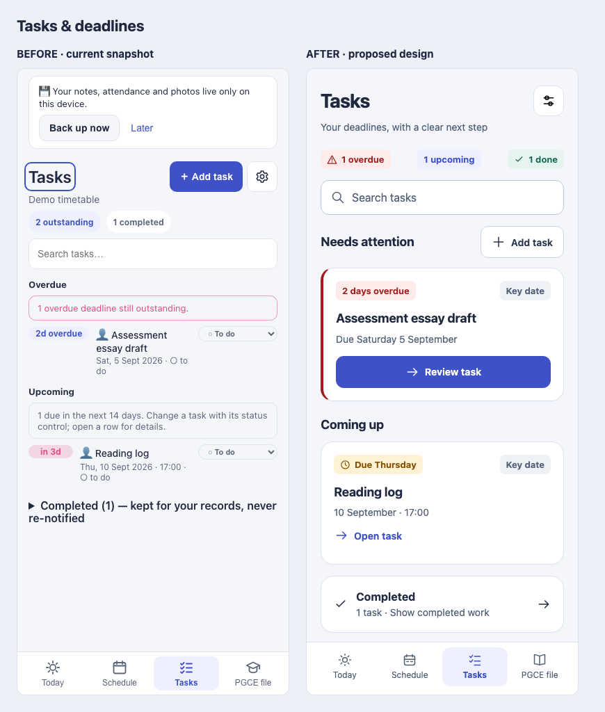

**Current:** the task title, due badge and tiny status dropdown compete in one narrow row. Pink status colouring is visually weak, and an explanatory sentence repeats information already in the group heading.

**Proposed:** an overdue task has a dark red labelled badge and a readable card; the upcoming task has a dated amber badge. Each title gets its own line and one clear action. Completed work becomes a quieter disclosure. Search, add and summary counts remain at the top.

**Implementation:** `src/features/tasks/TasksPage.tsx`, `.keydate-row`, `.keydate-line`, `.kd-chip`, `.workload-line.heavy`. Replace hard-coded legacy status colours with semantic tokens. Keep completion/undo accessible from the card or detail; do not remove inline completion solely to imitate the concept. Preserve user task, source deadline and mentor-action provenance without exposing internal record identifiers. Do not show all source records as externally connected key dates: the fixture includes custom dates. Keep complete titles and full due dates in accessible labels.

**Acceptance:** long title at 320px, overdue/completed state separation, task status change still updates the canonical owner once, search across task types, empty and no-match states, desktop maximum reading width and correct sorting. Do not change deadlines or reminders as part of restyling.

## 10. Before and after: PGCE workspace

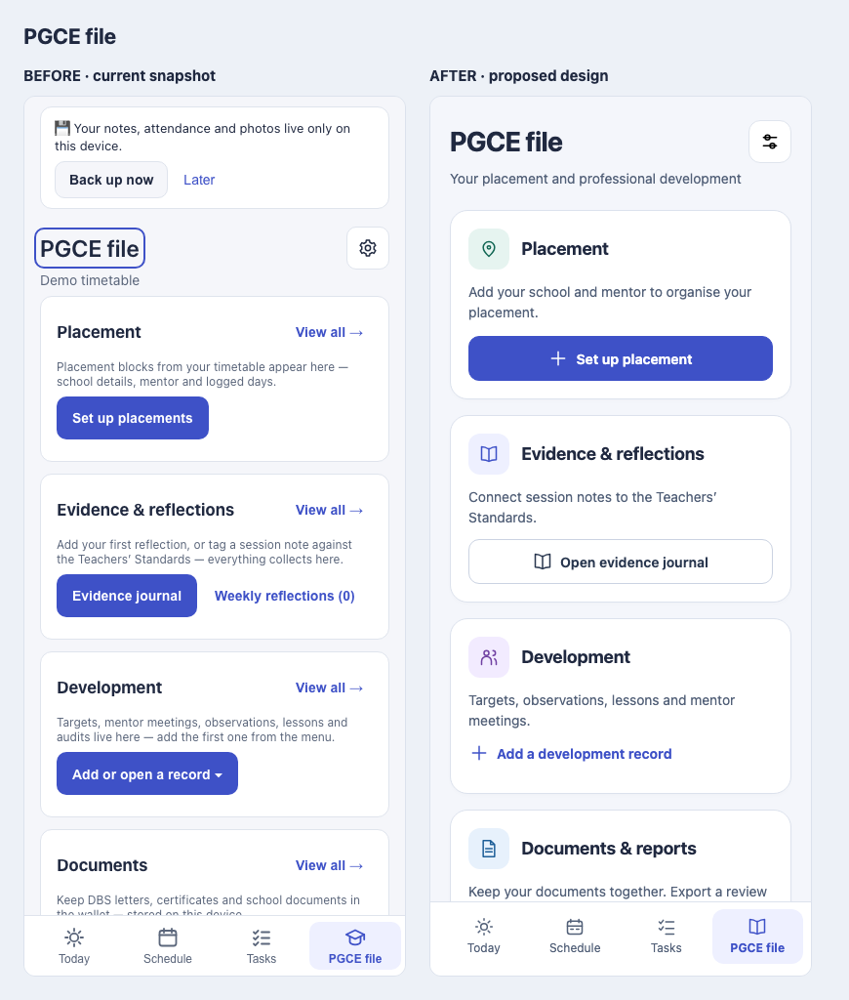

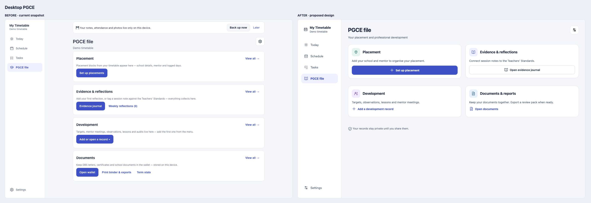

**Current:** repeated “View all” and equally strong primary buttons compete; 12px descriptions carry important navigation information. Desktop has space to create clearer groups.

**Proposed:** four visually distinct sections with consistent icons: teal Placement, indigo Evidence, violet Development, blue Documents. Desktop uses a two-column arrangement. The empty-state primary action is Set up placement; existing records should change this to Open placement and surface relevant status.

**Implementation:** `src/features/pgce/PGCEPage.tsx`, `PlacementPage.tsx` and linked sheets. Preserve weekly reflections, targets, observations, lesson plans, meetings, audit records, wallet, binder and term stats; the cards are section entry points, not a reduced feature set. Replace vague “View all” accessible names with the destination. Put attendance analysis in the placement/stats area, with a link from Data & devices for continuity. Do not invent progress/compliance percentages in empty states or treat evidence count as competence.

**Acceptance:** test both empty and populated PGCE fixtures; every existing record editor remains reachable within two purposeful steps from the section; returning restores context; count badges reflect actual records; no document/note content is shared by opening a card.

## 11. Before and after: Settings

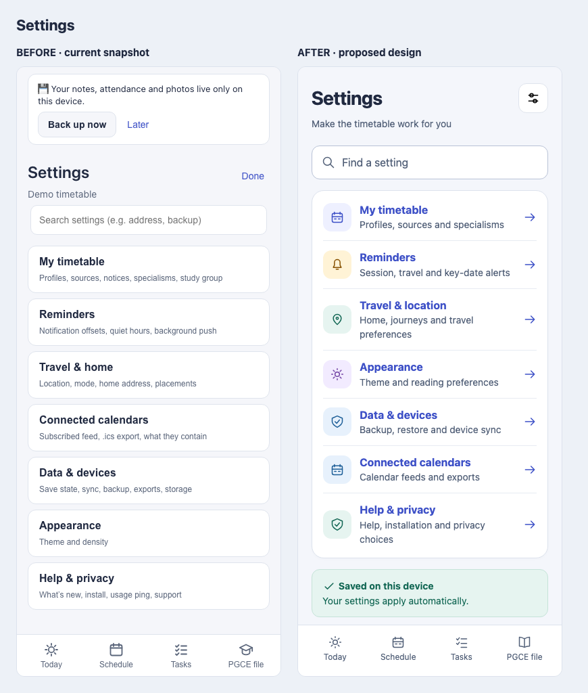

**Current:** seven similar white cards with 12px descriptions, no icon landmarks, and a persistent recovery nudge before the page heading.

**Proposed:** a readable grouped list with coloured icon tiles, consistent description size and clear chevrons. Retain all seven categories: My timetable, Reminders, Travel & home, Connected calendars, Data & devices, Appearance, Help & privacy. The mockup's “Travel & location” is optional wording; keep one name consistently across routes, headings and search.

**Implementation:** `src/components/SettingsSheet.tsx`. Use a full-row link/button with a single accessible name. Avoid a nested icon button inside the row. Keep category search and deep links. The Settings header needs Done/Back, not a second Settings button; the shared mockup header is a reusable placeholder to replace during implementation. “Saved on this device” may render only from real persistence state. Leave existing privacy choices opt-in/out as implemented.

**Important retained correction:** key-date timing belongs under **Reminders**; its source belongs under **My timetable**. This is already fixed in the current project. Preserve and test it rather than rebuilding it.

## 12. Before and after: Data & devices

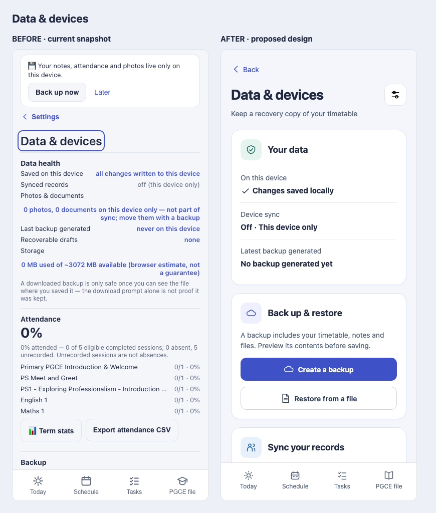

**Current:** many long right-aligned values wrap; attendance and subject rows separate data health from the backup buttons, which fall below the first screen. Technical details compete with recovery actions.

**Proposed order:** local save/sync/backup state → Create backup / Restore → connect another device → storage and advanced details. Move full attendance reporting to PGCE stats. Show storage and recoverable drafts inside an expandable health detail, with draft problems surfaced automatically rather than hidden by default.

**Implementation:** `SettingsSheet.tsx`, `BackupSheets.tsx`, persistence status and sync status. Left-align mobile values under their labels; only use two-column label/value rows above 640px. The current sync fix has a real status and cadence—retain those, and distinguish synced records from unsynced attachments. Cloud-backup controls remain a separate provider section once the work is integrated and configured; no fake Google/iCloud connection state in the design.

**Acceptance:** backup/restore visible before specialist attendance analytics; no “safe backup” claim after merely generating a download; pending saves dominate normal success; offline sync reads Offline; missing storage estimate remains unknown; existing restore preview and unrelated-profile protection remain intact.

## 13. Before and after: Reminders and Find

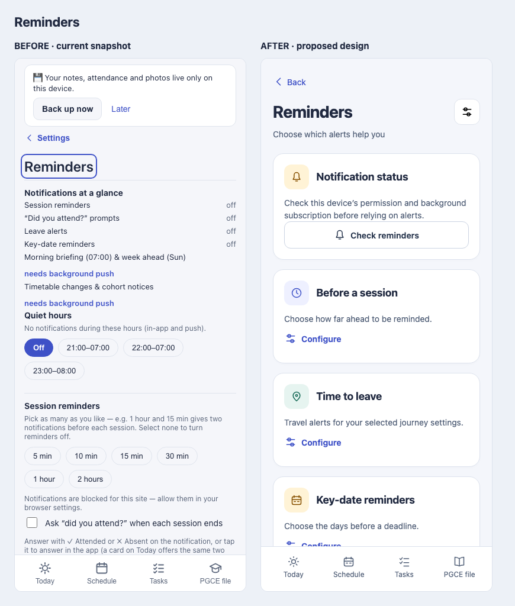

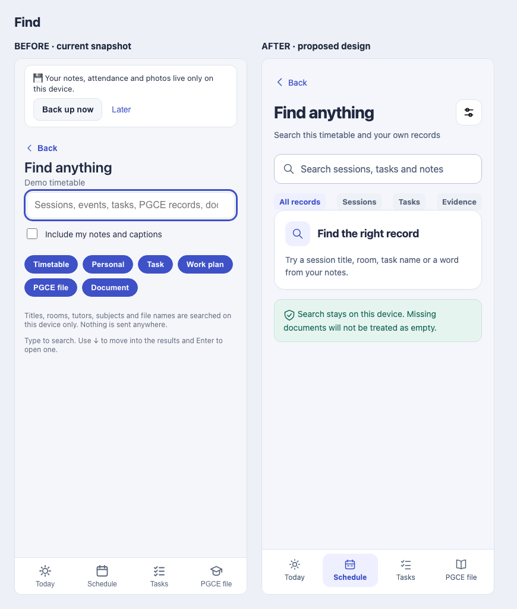

**Reminders:** break choices into device status, session reminders, leave alerts, attendance prompts, key dates and quiet hours. The concept shows the first groups; attendance and quiet hours must remain accessible below them. “Configure” opens the existing values rather than a fresh duplicate setting. Put status beside the relevant group and replace compressed chip clusters with wrapping 44px controls. Keep a visible timezone label. Do not replace a known blocked permission state with vague advice: the synthetic current fixture reports blocked notifications; its implemented counterpart must say **Blocked on this device** with the appropriate recovery steps.

**Find:** retain all indexed types and existing keyboard navigation. Present a clearly labelled search field with scope chips and grouped results. The concept's short filter row is illustrative; existing personal-event, document and evidence scopes must remain available. Explain which content is actually indexed. An unavailable local attachment is not a search result containing its unindexed text. Do not add global recent-search tracking as part of this visual change.

**Acceptance:** zero/many results, long titles, keyboard arrows and Escape, focus return to caller, clearing filters, reminder values retained, blocked/unsupported/granted permission fixtures, and no permission prompt merely from viewing Settings.

## 14. Before and after: admin analytics

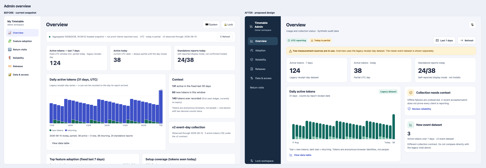

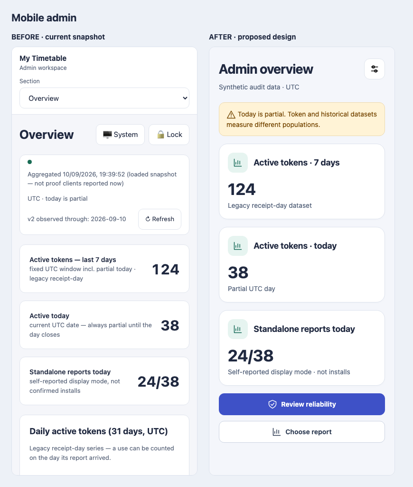

**Current:** the overview correctly provides important caveats, but they compete with the metrics; emoji navigation is inconsistent with the learner app. A user must read several dense paragraphs to understand the difference between legacy and event-day collection.

**Proposed:** a navy admin rail makes the app distinct while retaining shared type, spacing and icon language. Headline cards preserve **124 active tokens / 38 today / 24 of 38 standalone reports** from the same legacy fixture. A separate v2 card retains **3 active tokens over seven days** and explicitly warns against direct comparison. Source, period and partial-day state stay near their numbers. Mobile uses vertically stacked cards and a clear report selector.

**Implementation:** `src/admin-analytics/AdminApp.tsx`, `pages/Overview.tsx`, `components/ActivityChart.tsx`, `components/bits.tsx`, `admin.css`. Share base primitives/tokens where useful; keep separate app identity and access boundary. Retain Return visits, Feature adoption, Reliability, Releases, Data & access and Lock. Do not let the concept's simplified navigation lose pages. A reporting-window control is only interactive where the metric really supports that window; fixed seven-day metrics must not appear to respond to an unrelated date picker.

**Charts:** keep zero baselines, explicit units, date ticks, a labelled legend and an equivalent data table. The proposed image demonstrates a palette/layout, not a replacement chart implementation. Use the real chart model and preserve keyboard/tooltip selection. Missing data is unknown, never a zero bar. Show last loaded timestamp and source freshness. The mockup does not prove 124 people used the app; token identity remains distinct from people and installations.

**Acceptance:** no credential in URLs, screenshots, exports or local persistence; lock clears protected state; expired requests cannot repopulate after lock; incomplete/partial/missing/small-denominator fixtures stay honest. Do not activate retention jobs, alter metrics contracts or add telemetry as a side effect of the redesign.

## 15. Colour, typography and icon specification

### Colour system

Use semantic CSS custom properties, not screen-specific hex values. Preserve indigo as the app's main action colour. The suggested pairs below were calculated using relative luminance, with results in `evidence/contrast-calculations.json`.

| Role | Text / background | Sample text contrast | Use |
|---|---|---|---|
| Primary action | White / `#3e51c7` | 6.55:1 | One main next action |
| Supporting text | `#526078` / white | 6.36:1 | Descriptions, dates, source labels |
| Saved/completed | `#116653` / `#e6f4f0` | 6.09:1 | Text + check icon |
| Attention | `#865000` / `#fff3d6` | 6.02:1 | Missing input, approaching deadline |
| Error/overdue | `#9f1d1d` / `#fdecea` | 6.88:1 | Text + alert icon |
| Development category | `#7041a2` / `#f2ebff` | 6.10:1 | Section identity, not warning |
| Information category | `#1e5f98` / `#e7f1fc` | 5.85:1 | Documents and information |

The existing `.workload-line.heavy` uses `#e64980` on `--bg: #f5f6fa`, calculating to **3.45:1** for its small text. Replace it with the error tokens; inspect related hard-coded pink/orange labels individually rather than assuming all share the same background. This is a specific sample finding, not a blanket claim about the whole theme.

Target at least 4.5:1 for ordinary text and 3:1 for qualifying large text. Evaluate icons, essential control boundaries, focus and state indicators separately. [W3C text contrast guidance](https://www.w3.org/WAI/WCAG22/Understanding/contrast-minimum).

Colour must always have text/icon/shape support. Do not reuse amber solely as a decorative subject colour when it already means a warning nearby. Do not encode every subject and every status into competing saturated backgrounds. Light fills with dark text are sufficient.

### Type and spacing

- Keep the native system font stack. No new remote fonts are required.
- Mobile page title: 26–28px / 32–34px, weight 700. Section heading: 18px / 24px. Card title: 16–18px / 23–26px.
- Main reading text: 16px / 24px. Supporting explanation: **14px / 20px**. Use 12–13px only for brief metadata or dense desktop calendar labels, never the sole explanation of an important state.
- Mobile gutters: 16–20px. Card padding: 16–18px. Between sections: 20–24px. Use the existing 4/8/12/16/24/32 spacing scale.
- Card radius: 14–18px; control radius: 10–12px. Keep shadow subtle. Avoid placing one decorative card inside another unless it represents a real subtask.
- Use tabular numerals for times and metrics. Do not truncate a critical date, error or state to save space.

### Touch and icons

The captured controls include 27px view tabs, 24px arrival chips, 32px attendance actions and a roughly 15px Copy address action. Their sizes are below the proposed **44×44px product target**. This is not an assertion that every one fails WCAG AA: its 24px minimum has spacing and other exceptions. [W3C target-size guidance](https://www.w3.org/WAI/WCAG22/Understanding/target-size-minimum).

Use one line-icon family in production, ideally the app's existing icon primitives, with 20px icons in 44–48px controls. The provided mockups contain simple vector exemplars. Decorative icons are `aria-hidden`; icon-only buttons need names; frequently used ambiguous actions also need visible labels. Avoid emojis for core navigation, exports and placement controls because rendering and interpretation vary. Emoji in optional personality copy is a separate choice.

### Dark theme

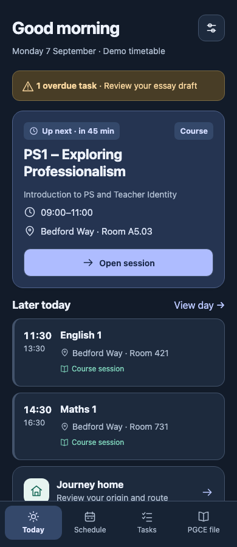

Use independently checked dark tokens: background `#121b29`, surface `#1d2a3d`, primary text `#edf2fb`, supporting text `#b1bfd2`; sampled surface contrasts are 12.89:1 and 7.76:1. Do not invert light screenshots or reuse dark foregrounds on dark badges. Check active/hover/disabled/error/focus separately. The dark image is supplemental design direction, not a matched current-state comparison or a full dark-theme accessibility audit.

## 16. Nonvisual project findings to carry forward

### B-01 — Working-tree production build is blocked

`src/lib/cloudBackup/snapshot.ts:30` returns profile settings typed as `Record<string, unknown>` where `ProfileEntry` requires `Settings` with `sheetUrl`, `sheetId` and `gid`. This is untracked work in progress, not a claimed deployed regression. The normal build log records TS2322.

**Fix guidance:** use a typed projection that removes only optional provider/device fields while retaining required Settings keys. Do not silence it with an unchecked whole-object cast or relax ProfileEntry globally. Validate the stripped snapshot, then run the normal build and backup round-trip tests. Recheck the current implementation first because another developer is actively working here.

### Earlier reliability findings remain relevant

Source inspection still shows the prior audit's attendance HTTP acknowledgement, report identity/deduplication, union-only suppression, device-clock reminder calculations and destructive shared-photo dequeue paths. Global backup-generation bookkeeping and restore-impact wording also remain relevant. Use **FA-01–07 in the earlier [project audit](../project-audit-2026-09-10/PROJECT_AUDIT_2026-09-10.md)** for the detailed fixes and acceptance tests. Those are source-rechecked carry-forwards; this UI audit did not repeat every earlier targeted reproduction.

The device-to-device sync cadence/timeout issue was fixed at the current baseline and has two-device regression coverage. Do not report the old missing periodic pull as a new bug. Cloud backup is actively being implemented; do not claim it is available merely because a folder exists. Existing major feature proposals MF-01–07 remain in the earlier document; this package refines the interface and does not cancel those proposals.

### Maintainability observations

`src/index.css` mixes current semantic tokens with older hard-coded colours and component-specific button treatments. Consolidate only the shared controls needed for this redesign, with regression coverage; avoid an unrelated complete CSS rewrite. Keep learner and admin component variants explicit. The large App orchestration layer means UI refactors must preserve owner/profile identity, persistence handling, navigation state and telemetry success points. Styling is not permission to change sync schemas, worker metrics, reminder rules or collection consent.

## 17. Delivery plan and acceptance gate

**Batch A — Foundations:** fix/recheck B-01; introduce shared typography, semantic status, icon and 44px control variants; remove sampled contrast failures. Preserve the working developer's cloud changes. Add meaningful contrast/interaction checks rather than snapshot assertions that merely mirror markup.

**Batch B — Daily use:** Today, mobile/desktop Schedule, Tasks and Session detail. Implement the grouped overlap interaction only with its expansion and keyboard tests. Keep canonical events and persisted state intact.

**Batch C — Travel and settings:** origin-first journey states, home flow, readable settings list, Data & devices grouping and reminder sections. Implement actual status-specific content; do not copy placeholder reassurance from a static mockup.

**Batch D — PGCE and admin:** preserve all record/editor/report routes; add section hierarchy and admin dataset labelling. Admin chart data contracts and access rules remain unchanged.

**Batch E — Validate and archive:** run the normal TypeScript build, unit and browser suites; follow repository validation for both hosting bases. Capture populated and empty screens at 320/390/768/1024/1440px, light/dark, reduced motion and enlarged text. Test keyboard-only operation, focus after route/modal transitions, scroll reachability, permission failures, map failure, stale data, unsaved edits and offline state. Passing the Vite-only visual bundle is not the release gate.

Keep before/after fixture content identical. The production calendar must reflect real timing; charts must retain original quantities/definitions. Do not remove controls to make screenshots tidier. Any relocation needs a documented destination and a navigation test. A final designer/developer review must inspect screenshots as well as test assertions.

### Required archive step on completion

After the corresponding enhancements are complete and verified, **move this Markdown file, the completed visual designs, before/after screenshots and supporting audit artefacts into `archive/enhancements/<date>-visual-ui/`** to keep the project clean. Preserve relative links and include a small archive README with completed issue IDs and verification results. Link to it from the active documentation index/PLAN.

Keep unfinished feature proposals and development plans discoverable until their work is complete. Do not archive production source, runtime icons/assets, permanent regression tests, active runbooks, secrets, user backups or another developer's unfinished work. Temporary snapshot/runtime folders are not handoff assets and must not be copied into the project archive. Update existing references when moving the finished package; verify the gallery and Markdown images still open.

## 18. Files for implementation

- `designs/gallery.html`: browsable before/after comparisons.
- `designs/after-*.html` and `designs/design.css`: inspectable proposed layouts and visual tokens. These are illustrative static screens, not drop-in React components.
- `designs/compare-*.png`: side-by-side figures embedded above.
- `evidence/before-*.png`: current synthetic app captures.
- `evidence/ui-measurements.json`: captured control sizes, small text and overflow.
- `evidence/contrast-calculations.json`: sampled colour-pair calculations.
- `evidence/build-results.txt`, `unit-results.txt`, `browser-visual-bundle-results.txt`: exact validation outputs and limits.
- `evidence/visual-review.spec.ts`: reproducible capture fixture; adapt paths for the normal test tree before reuse.

The implementation brief is the combination of the behavioural requirements in this Markdown and the visual hierarchy in the designs. Where a mockup abbreviates controls or text, the preservation/acceptance requirements above take precedence.
