# Helping students through their PGCE and towards QTS

**Student-experience audit and feature handoff · 10 September 2026**

This audit proposes a connected training workspace built on the timetable, PGCE records, planning, evidence and backup features already present. Its purpose is to help students decide what to do next, improve their teaching and prepare for meaningful reviews, with less duplicate administration.

**[Open the visual mockup gallery](designs/gallery.html)**. All 27 proposed mobile/desktop screens are also illustrated in this document. They contain synthetic people, dates, schools and course content. They are design examples, not implemented functionality, teaching prescriptions or official assessment results. Links between selected prototype screens work; form fields, tabs, export buttons and planning actions are illustrative unless explicitly described as navigation.

This package is separate from `visual-ui-audit-2026-09-10/`. Continue that work; do not replace its V0–V5 plan or preservation register with these proposals. No application code, provider settings, course data or external service was changed in this audit.

## 1. Main recommendation

Build a **connected teaching-development cycle**:

**Understand the course → prepare a lesson → rehearse a focused technique → teach → discuss feedback → try again → select useful examples for review.**

Connect academic assignments and realistic time planning to that cycle. Make professional and academic progress understandable without claiming to predict whether someone will qualify.

Prioritise these three additions:

1. **Lesson and practice workspace:** link planning, subject knowledge, rehearsal, observation, feedback and the next attempt.
2. **Course-aware programme roadmap:** separate academic milestones, placement/training experiences and provider reviews, with requirements drawn from the student's actual course.
3. **Mentor preparation and selected review packs:** turn existing records into a useful conversation and manageable next actions without making the student enter them again.

The larger assignment, workload and knowledge proposals from the previous audit remain relevant. This document makes them specific to teacher training rather than introducing parallel versions of the same features.

## 2. Scope and evidence

### Current project baseline

Source reviewed at commit `d58a91f`, with active modifications in backup, cloud snapshot, push, shared-photo intake, storage and the push worker. The snapshot status and hashes of the inspected files are in [baseline.json](evidence/baseline.json). Another developer is implementing the visual audit; the baseline will move. Recheck source before development and preserve their changes.

Relevant current capabilities:

| Existing capability | Source evidence | What remains missing for the student journey |
|---|---|---|
| Weekly reflections | `src/lib/admin.ts`: week, successes, challenges, focus and standards | Explicit links from reflection to lesson, feedback and next attempt |
| Targets | Same module: text, standards, status and source category | Specific source-record identity, practice attempts and review history |
| Mentor meetings/actions | Same module: date, discussion and actions | Preparation agenda, duration/provenance, linked review pack and follow-up cycle |
| Observations | Same module: observer, subject, focus, strengths/development | A linked lesson and distinction between learner transcription and authenticated reviewer feedback |
| Lessons taught | Same module: date, class group, subject, evaluation, standards | Pre-lesson planning, sequence context, rehearsal, versions and connected resources |
| Subject knowledge audit | Same module: subject, baseline/revisited/secure stage, note | Topic-specific learning steps, resources, application and self-rating provenance |
| Placement calendar and exceptions | `src/features/pgce/PlacementPage.tsx`, `src/lib/placement.ts` | Broader experience/mentoring/ITAP ledger with provider-specific rules |
| Evidence journal and selected binder | `src/components/JournalSheet.tsx`, `src/lib/printBinder.ts` | Curated learning narrative and versioned review context, beyond tags/counts |
| Tasks and work blocks | `src/lib/admin.ts`, `src/lib/planProjection.ts` | Academic-project context and sustainable planning across connected work |
| Standards labels | `src/lib/standards.ts`: TS1–TS8 | Part Two context and separate curriculum/review frameworks |

These are source-confirmed product gaps. They are not findings from interviews with actual students, nor evidence that the current app is formally non-compliant. The app is a personal organiser, not an accredited training provider. Usability and learning benefits below are design hypotheses to test with trainees.

The current development plan records cloud backup and the device-sync fix as delivered. This audit did not connect to those services or repeat their deployment verification. It does not reopen the older “cloud backup absent” or “no periodic sync” findings. Existing visual and reliability work stays on its own plan.

### England is the initial scope, not an implicit UK-wide rule

PGCE is an academic qualification; QTS is professional status. Courses may offer QTS alone, PGCE with QTS, or PGCE without QTS. The app must represent the actual route rather than treating them as one “degree completion” score. [DfE: what is a PGCE?](https://getintoteaching.education.gov.uk/train-to-be-a-teacher/what-is-a-pgce)

For England, the current ITT criteria distinguish ongoing formative assessment against the training curriculum from end-of-course assessment against the Teachers' Standards. Provider accountability and individual programme design matter. Requirements must carry source, academic year and applicability, rather than being copied as universal student checkboxes. [DfE: ITT criteria, 2026–27](https://www.gov.uk/government/publications/initial-teacher-training-criteria/initial-teacher-training-criteria-and-supporting-advice-2026-to-2027)

The ITTECF informs training curriculum design and is not itself an assessment framework. Do not create a red/green ITTECF “pass tracker”. [DfE: Initial Teacher Training and Early Career Framework](https://www.gov.uk/government/publications/initial-teacher-training-and-early-career-framework)

The Teachers' Standards include professional practice and personal/professional conduct. An eight-tag evidence interface alone should not be presented as the complete QTS assessment framework. [DfE: Teachers' Standards](https://www.gov.uk/government/publications/teachers-standards)

Default prototype: an **example primary, ages 5–11, England PGCE-with-QTS programme**. This reflects the current app's primary-course emphasis. Secondary, QTS-only, part-time and other routes must be selectable without inheriting inappropriate primary or full-time requirements. Other jurisdictions require their own verified programme pack. Until configured, show “Requirements not yet confirmed”, not assumed shortfalls.

**Additional owner requirement:** P1, P2 and P3 occur at different schools and must be configured separately, with records and outward/return travel linked to each. See PG-07A below.

## 3. Experience risks to address

| ID | Finding | Student consequence | Required response |
|---|---|---|---|
| EDU-01 | Records exist mostly as separate collections | Re-entering context; feedback may never affect the next lesson | Stable links and one connected practice cycle |
| EDU-02 | TS1–TS8 tags can be mistaken for a qualification checklist | Students may chase evidence volume instead of development | Separate curriculum learning, selected evidence and provider assessment |
| EDU-03 | Observation and target provenance is limited | Learner notes may appear to be authoritative mentor judgements | Explicit author/source/review states |
| EDU-04 | Placement totals describe logged activity | Hours or attendance may be mistaken for fulfilled course requirements | Planned/logged/reviewed distinctions and versioned provider rules |
| EDU-05 | “Secure” subject-audit stage has no explicit provenance field | Confidence can look like externally assessed mastery | Label it self-reported; keep external review separate |
| EDU-06 | Lesson record is primarily retrospective | Students get little help before the lesson | Preparation, rehearsal and teaching-time access |
| EDU-07 | No course-specific academic/professional roadmap | Students cannot easily see what matters next on their own programme | Two distinct pathways with sourced milestones |
| EDU-08 | More forms could increase workload | Adoption may fall when school workload rises | Reuse data, short optional prompts, no evidence quotas or streak penalties |

Do not infer that all these misunderstandings currently occur. They are risks arising from the inspected model and interface that the proposed features should explicitly prevent.

## 4. Proposed information architecture

Keep the current four main destinations: **Today / Schedule / Tasks / PGCE file**. Preserve maps, TfL, journey home, notifications, all existing editors, Find, sync and backup. The visual development plan's no-functionality-loss rules apply.

- **Today:** the next session plus up to three relevant next steps, with an optional practice focus. Do not turn it into a wall of academic scores.
- **Schedule:** existing timetable and placement sessions, with rehearsal/study blocks using the canonical planning model.
- **Tasks:** personal tasks and academic projects. A mentor action links back to its meeting; it is not copied into an independent second task.
- **PGCE file:** My programme, Lessons & practice, Mentor preparation, Subject knowledge, Placement experience, Evidence & reviews. Existing forms remain available behind those entry points.
- **Settings:** route/provider requirements, appearance, privacy, reminder preferences and data controls. No provider credentials or school secrets in a course pack.

Desktop may add contextual PGCE navigation below the main four destinations. Mobile uses an overview with labelled section cards, not twelve bottom tabs.

### Student overview — mobile and desktop

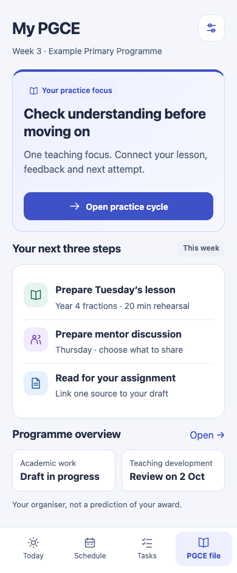

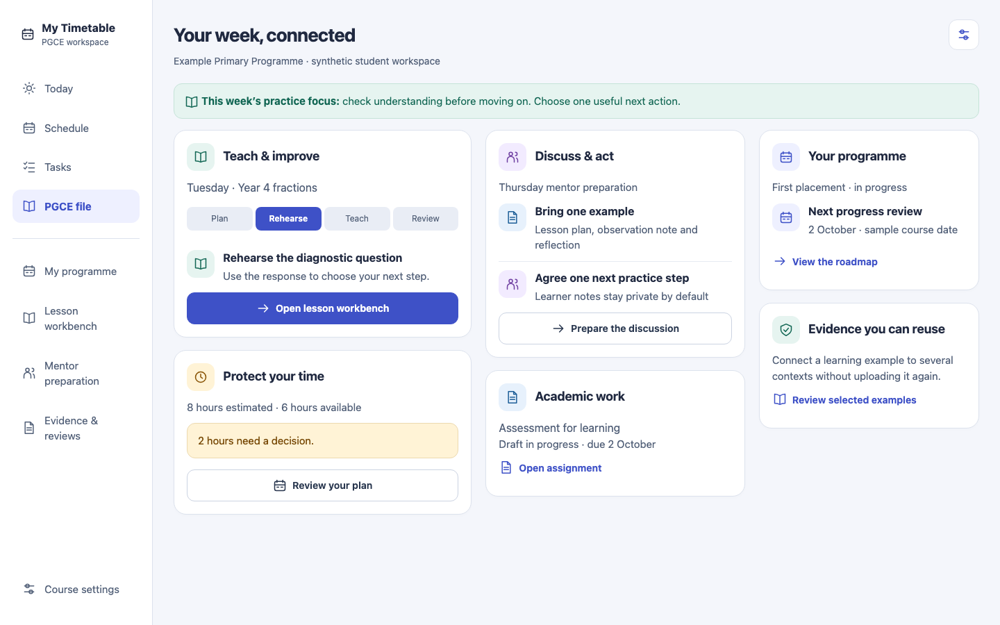

The “next three steps” are suggestions derived from explicitly dated work and the student's selected practice focus. They are not a hidden productivity ranking. Selecting an item opens its original record. Students can dismiss or pin suggestions. Unknown due dates do not become overdue. A returned student, part-time student or student on an agreed pause should receive an appropriate plan, not a failure message.

## 5. PG-01 — Course-aware programme and review roadmap

**Outcome:** “I understand the academic work, school experiences and reviews on my programme, and know which details still need checking.”

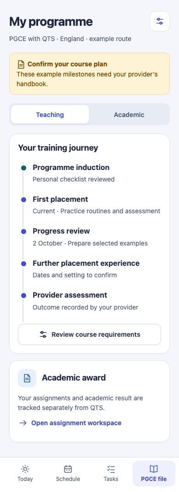

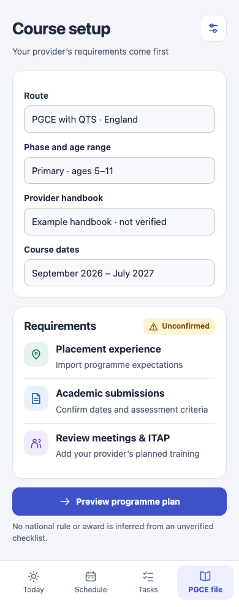

**New functionality**

Create a versioned CourseProfile with route, jurisdiction, academic year, provider label, phase/subject/age range, start/end dates and full-/part-time pattern. Accept a manually entered or imported programme pack. First release supports structured JSON/manual forms with validation; handbook/PDF extraction can suggest draft requirements later, always requiring review. No institution connector is required for the initial value.

Maintain separate **Academic** and **Teaching/training** milestones. Academic items include assignments and recorded results; training items include placements, provider-designated ITAP, curriculum blocks and progress reviews. Provide a third reference area for official outcome documents, without allowing an ordinary checklist completion to create an awarded qualification.

Each requirement has an owner/source, source URL or file reference, section/page, applicability, effective dates, version, planned value and verification state. Default state is **Unconfirmed**. User-entered handbook information is “Confirmed by you from [source]”, not “Verified by provider”. A provider-reviewed state requires authenticated provenance or is clearly labelled as a user-recorded report of that review. Do not ship a hard-coded 120-day target or infer rules for a different route.

**Flow:** choose route → preview applicable programme → confirm sources → add course dates → review upcoming milestones. On pack update, preview changed rules and affected milestones; historical reviews remain pinned to their old pack version.

**UI:** two labelled pathways, one next review, subdued future milestones and a visible unconfirmed-requirements count. Avoid a single completion ring. The roadmap's stage markers describe organisation, not readiness for QTS. Date changes generate a diff; nothing moves silently.

**Reuse:** profiles/settings for context, existing key dates for deadlines and placement blocks for school dates. Source deadlines remain source-owned; a milestone references them rather than creating duplicate sessions.

**Acceptance:** QTS-only route hides academic award assumptions; PGCE-without-QTS has no QTS review track; part-time dates do not use full-time pacing; missing provider data stays unknown; updating a requirement never rewrites a recorded review; pack export/import retains provenance.

## 6. PG-02 — Lesson preparation and teaching workbench

**Outcome:** “I can prepare the teaching decisions that matter, have them available in school, and evaluate the same lesson afterwards.”

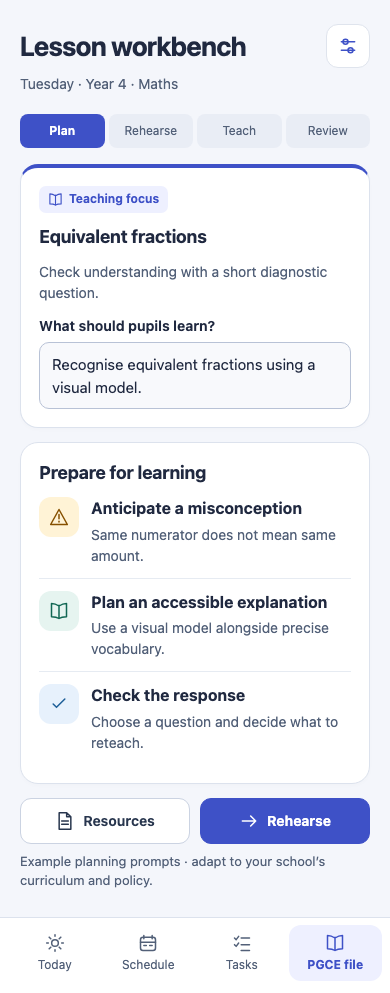

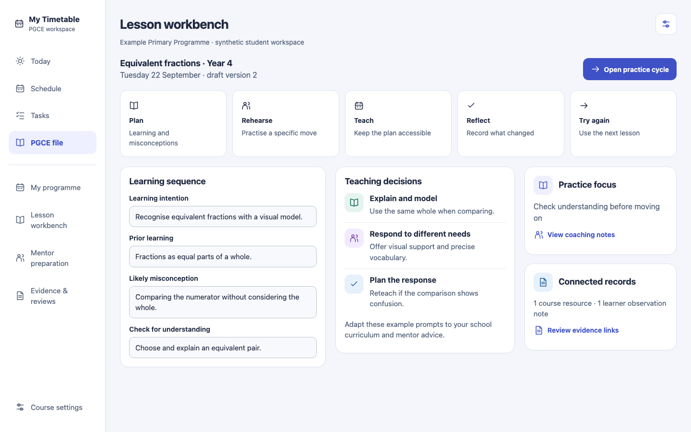

**New functionality**

Extend the existing Lesson record with a linked timetable occurrence, sequence/unit context, learning intention, prior knowledge, anticipated misconceptions, teaching sequence, checks for understanding, planned responses and resource references. Support provider/school templates without forcing every field on every lesson. Structured planning prompts are optional, reusable aids; the school curriculum and mentor advice remain authoritative.

Add **Plan → Rehearse → Teach → Review** views over one canonical lesson. Rehearse links to a focused practice cycle. Teach mode shows the essential plan and resources offline with large controls; it does not become a live pupil-data collection screen. Review captures what changed, what the student noticed and one next attempt. Keep planning and evaluation versions distinct so a later edit does not rewrite what was originally prepared.

Allow planning a short sequence of lessons with links between them. Carry forward resource links and context, but make the new lesson's objectives and evaluation explicit. Duplicating a plan must not copy old attendance, feedback authorship or a previous evaluation as new work.

**Inclusive planning:** optional prompts for accessible explanations, vocabulary, checks and adaptations at class/task level. Do not require names, diagnoses, pupil photos or individual support-plan details. School-specific pupil information remains in approved school systems. Example prompts in the mockups are illustrative, not a prescribed method for teaching fractions.

**UI:** mobile stage navigation and one primary action; desktop separates learning sequence, teaching decisions and linked development focus. A concise teaching-mode view should be reachable in one tap from the lesson/session. Save status and offline availability must be real. The stage strip is navigation, not a formal grading scale.

**Reuse:** extend Lesson rather than adding another unrelated lesson store; existing reflection, observation, standards and resource records are references. Preserve the existing quick retrospective lesson entry for students who do not want a full plan.

**Acceptance:** existing lessons open unchanged; partially completed plans remain valid; draft survives reload; offline teaching view can open previously cached resources and labels missing ones; duplicate creates new identity without copied outcomes; saving the review does not mark the lesson attended or change official course records.

## 7. PG-03 — Focused practice and mentor coaching cycle

**Outcome:** “Feedback leads to something specific I practise, rather than another note that I never revisit.”

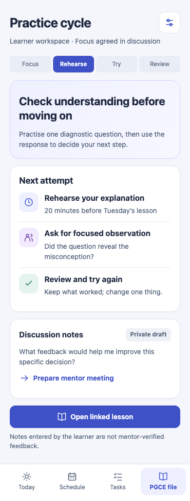

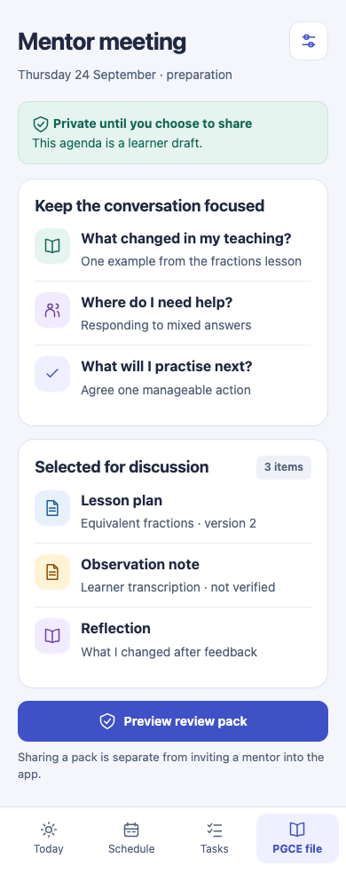

**New functionality**

A PracticeCycle links a development focus to relevant curriculum content, rehearsal, lesson attempts, observation/feedback and a review decision. The student or mentor can choose a manageable focus; the app does not diagnose teaching competence. Encourage one active focus by default, allow more deliberately, and support pause/archive without a failure label.

A meeting-preparation view collects: what changed, where help is needed, examples selected for discussion and proposed next steps. Existing open meeting actions can be carried into the agenda as references. After the meeting, record what actually happened, optional duration, agreed actions and the next review date. Scheduled meetings do not automatically count as held mentoring time.

Feedback provenance is explicit: **Personal reflection / Learner-entered account / Authenticated reviewer comment**. A typed observer name is not authentication. Keep observations descriptive and allow learner response; do not let a generated summary rewrite another person's feedback. Changing a reviewed record creates a new revision.

**Release boundaries:** first ship local preparation, learner-entered feedback, selected exports and linked actions. An authenticated mentor portal is a later extension of MF-03, requiring permissions, invitations, revocation and secure attachment sharing. Nothing is emailed, shared or uploaded merely because a mentor is named. Review-pack export remains useful without a mentor account.

**UI:** one focus, a clear next attempt and a readable history. Use violet for meeting context and teal for an explicitly completed action, not for “good teacher”. Show the source of feedback beside the text. A completed action means the action was done; it does not mean a standard is met.

**Reuse:** TargetItem, Meeting, MeetingAction and Observation gain stable relational references. The existing `source: meeting | observation | manual` category alone is insufficient; add source record ID and revision. Keep task projection ownership intact.

**Acceptance:** feedback links to the correct lesson and cycle; one meeting action appears once in Tasks; marking an action done never marks a target formally assessed; learner-entered content cannot acquire reviewer authorship; changing the active profile cannot expose another profile's agenda; export contains only selected content.

## 8. PG-04 — Subject and curriculum knowledge learning plan

**Outcome:** “I can identify a specific gap, use an appropriate source, try the learning in a lesson and revisit my understanding.”

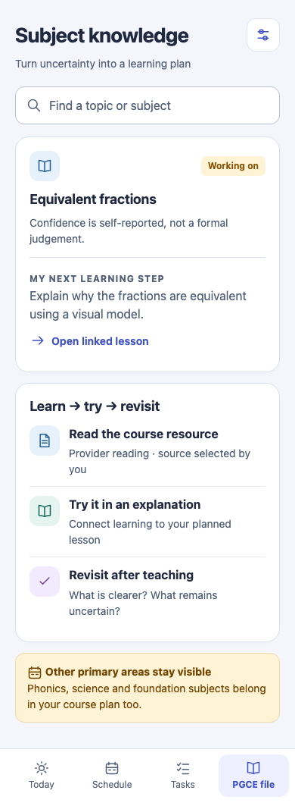

**New functionality**

Evolve broad subject audits into optional topic-level learning goals linked to the course curriculum. Each goal records the student's question, self-reported confidence, chosen resources, application opportunity and next review. Support primary breadth and secondary subject depth through programme packs; do not create a primary-only model or hide foundation subjects behind English/maths.

Keep three concepts separate: **self-reported confidence**, **activities undertaken** and **reviewer feedback**. Migrate an existing `secure` stage as “Previously marked secure by you” with original date preserved; never convert it into assessed mastery. Revisited is a dated learning event, not inherently an improved rating.

First release uses student/provider-selected resource links and notes. Add optional question cards or a brief self-check later, with answer/source explanations and “I need to revisit this”. Results do not affect formal progress. Optional document-grounded AI may suggest questions from selected materials only after source/provenance controls exist; the core workflow must work without AI.

**UI:** topic card → next learning step → source → lesson/application → revisit. Use small lists and plain labels rather than a red/green grid of every national curriculum statement. Include filtering by topic, subject and upcoming lesson. Unknown confidence stays unrecorded.

**Acceptance:** one resource can link to multiple goals without duplication; source changes do not overwrite personal notes; course switch changes applicable topic templates only after preview; self-rating and external feedback display separately; no fabricated citations or AI-generated “secure” ratings.

## 9. PG-05 — Academic assignment and enquiry workspace

**Outcome:** “I can organise the brief, reading, argument, draft milestones, submission and feedback while managing school workload.”

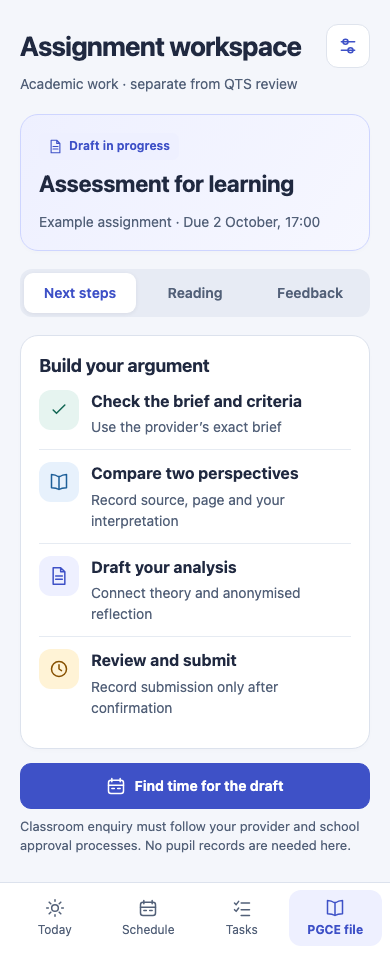

This is the PGCE-specific implementation of **MF-02**, not another project subsystem. Start with an assignment manually created or linked to an existing key date. Store the original brief, provider criteria, deadline, optional word/credit information and linked milestones. Credits and pass rules are provider-specific; no default award calculation.

A reading note distinguishes **exact quotation / paraphrase / personal interpretation**, with source and page/location fields. Resource reuse should support an argument outline and links to anonymised professional reflection. Citation metadata is recorded by the student or extracted with review; the app must not invent bibliographic details. Feedback from one assignment can create a linked improvement action for another.

If a task involves classroom enquiry, include an **approval planning** section: proposed question, provider/school approval required, recorded approval source and approved approach. Default to no identifiable pupil data and no data collection enabled by this organiser. Recording that the student says approval was obtained is not an official approval workflow. Keep raw pupil research data outside this app's initial scope.

Submission status is explicit: draft → ready → submitted by user confirmation → feedback received → result recorded. Opening an external submission link or exporting a document never marks Submitted. Store a receipt/reference only when provided. An entered result is labelled by its source and cannot automatically award the PGCE or QTS.

**UI:** next milestone first, then reading and feedback tabs. Show one actionable deadline rather than several nested percentage bars. Preserve manual task editing and existing work blocks. Later AI can help navigate selected materials, but should not create invented classroom experience or silently write an assessed submission.

**Acceptance:** deadline changes update the linked project without duplicate reminders; reading sources survive export; empty/unknown criteria are flagged; a failed export cannot mark Submitted; milestone completion does not equal assignment pass; provider grades and personal estimates remain separate.

## 10. PG-06 — Evidence curation with a learning narrative

**Outcome:** “I can explain a small number of useful examples and reuse them in the appropriate review, instead of uploading more evidence to make a counter turn green.”

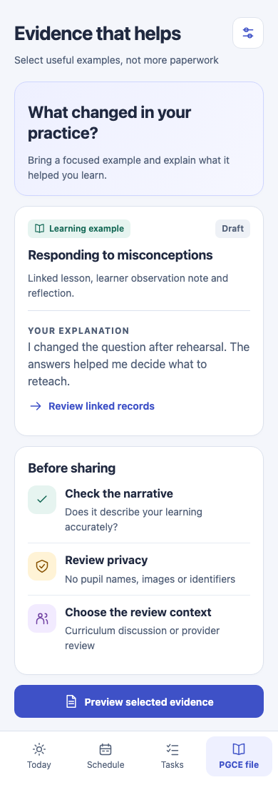

The current journal already aggregates records and supports selected binder exports. Extend it with an **EvidenceExample**: references to existing records plus a short narrative of context, teaching decision, what the student noticed and what changed next. No minimum number of photos, notes or standards tags. An example can legitimately prompt further discussion rather than prove success.

Provide separate contexts: course-curriculum discussion, practice-cycle review and provider assessment preparation. Version framework references. ITTECF curriculum references and Teachers' Standards references must not be the same enum or a combined completion score. Represent Part Two as professional-conduct context and provider review references; do not turn safeguarding conduct into a gamified incident log.

A selected review pack pins the versions included. Edits to source records after a review do not silently change its historical pack. Show when a linked record has changed or an attachment is unavailable on the device. The pack preview lists exactly what will leave the device, including author/provenance and captions. Privacy checking requires user review; automated scanning may assist later but must never assert complete anonymisation.

**UI:** choose example → explain learning → review linked material → choose review context → preview. Use “Selected”, “Draft” and “Discussed”, not “TS6 passed”. A tag indicates association only. Existing untagged/uncaptioned review queues remain available without treating untagged as bad evidence.

**Acceptance:** one source record can appear in multiple examples without duplicate blobs; deleting an example does not delete the lesson; old review versions remain understandable; missing attachments appear as missing; accidental inclusion of unrelated records is prevented; no evidence-count badge predicts qualification.

## 11. PG-07 — Placement experience and training-entitlement ledger

**Outcome:** “I can compare what was planned with what I actually experienced and discuss gaps with the provider using an accurate record.”

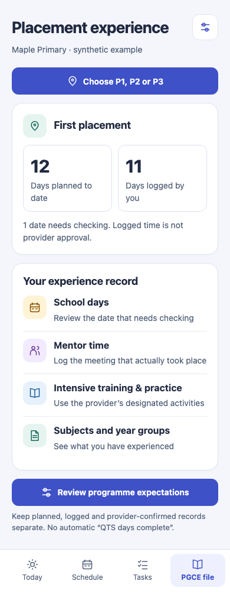

Extend existing placement days/hours and exception handling with experience records: school setting, phase/year group, subject, activity type, mentor meeting, observation, teaching and provider-designated intensive training and practice. The existing timetable remains the source of planned dates; actual occurrence requires explicit logging or a clearly defined current attendance action.

Maintain **planned**, **learner logged**, **discussed/reviewed** and **provider outcome reference** separately. Do not infer mentoring duration from a scheduled calendar slot, count a same-day training activity twice as two placement days, or reinterpret an inset day without the programme's policy. Keep whole-day attendance ticks distinguishable from corrected minute logs. An ITAP record must identify provider-designated training, not be assigned to any lesson the student found intensive.

Compute comparisons only against applicable, confirmed programme rules from PG-01. Where rules are unknown, show totals without a red deficit. If a rule uses equivalent days or specific experience categories, implement its explicit calculation and show it; never assume hours convert using one universal day length. Distinguish a possible gap to discuss from a breach of a national requirement.

**UI:** a simple planned/logged summary, dates needing review and grouped experiences. The prototype's 12 planned and 11 logged days are fictional values, not a programme target. “Check one date” is more helpful than “You are behind”. Provide an export for a conversation with the provider, with the source of each value.

**Acceptance:** holiday/inset/part-day correction remains consistent with existing placement code; cancelled dates do not count; meeting scheduled but not held is not logged; overlapping activities do not inflate a day; rule updates preserve historical calculations; unsupported routes have no invented target.

### PG-07A — P1, P2 and P3 are separate placements in different schools

**Clarification completed 11 September 2026.** **Owner note (11 September 2026, after the visual audit closed):** in the owner's records the three placements are called **SE1, SE2 and SE3**, matching the block prefixes the imported timetable already uses (SE1a, SE1b …). The mockups' P1/P2/P3 are illustrative labels only; implementation uses SE1/SE2/SE3 — see [DEVELOPMENT_PLAN.md](DEVELOPMENT_PLAN.md).

**Owner clarification:** the current experience handles all three placements in the same way. For this programme there are **three distinct placements—P1, P2 and P3—and each is at a different school**. Students must set up and manage them separately, and each related record and journey must link to the correct placement.

**Source nuance:** the app already has some per-tag school/address/mentor coordinates in `Settings.placements`, keyed by imported tags such as school-experience block identifiers. Working hours and inset policy also have profile-level settings. Preserve this existing information. The requested change is a first-class P1/P2/P3 model and usable school-specific workflows, not a claim that no per-school fields exist. Imported timetable tags must not be silently assumed to correspond to P1/P2/P3.

This is an explicit requirement for the owner's programme, not a claim that every PGCE nationally has exactly three school placements. Initialise P1/P2/P3 for this programme template; keep the underlying model extensible for other routes.

#### Placement chooser: three school workspaces

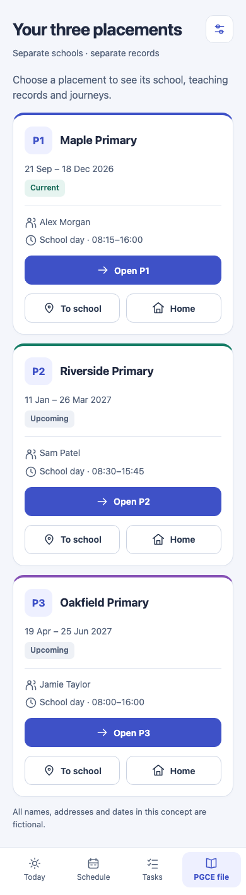

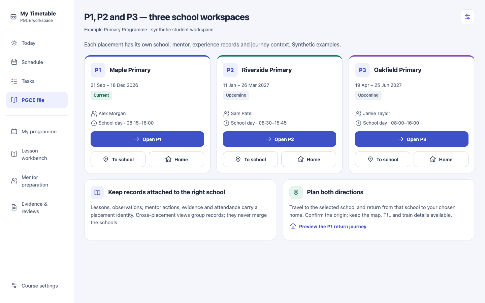

Each card displays placement code, school, date range, setup state, mentor and school-day hours. Provide **Open placement**, **To school** and **Back home**. Use stable code/name labels as well as colour; P1 indigo, P2 teal and P3 violet are navigation accents, not assessment or completion ratings.

Use separate setup states such as Not set up / School details incomplete / Ready to plan. Current / Upcoming / Finished describes dates, not setup or successful completion. Real school names, dates, addresses, contacts, hours and coordinates have not been supplied; all values in the mockups are visibly fictional and must not be installed as real defaults.

Viewing P2 must not overwrite the active P1 school, home, session destination or reminder context. “All placements” is a grouped reporting view; it does not combine the underlying school records.

#### School setup and per-placement detail

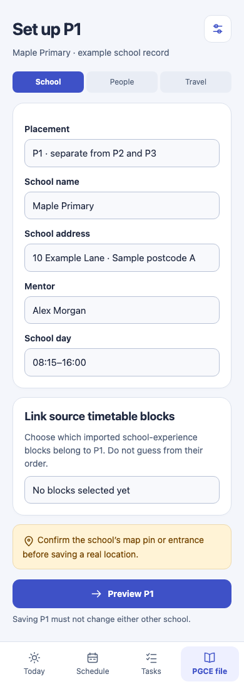

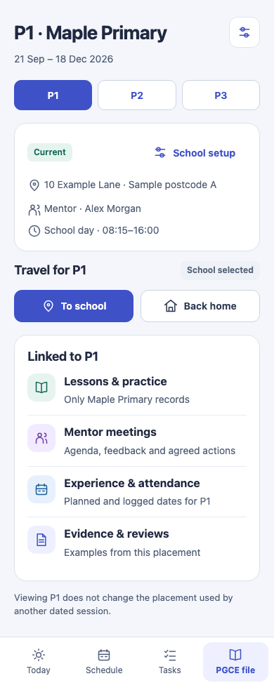

[P2 school workspace](designs/placement-p2.html) · [P3 school workspace](designs/placement-p3.html). Both have independent school setup and travel links in the prototype.

Required school record: stable placement ID, P1/P2/P3 code, school name, address, confirmed map coordinates/location reference, placement date range, mentor/contact details, working pattern, arrival preference and mapped timetable blocks. Coordinates must be confirmed against a visible map; a text address alone must not be treated as verified geocoding. School entrance information is optional and explicitly user-entered/verified, not inferred from a building-centre pin.

Store working hours and relevant school-specific policy as placement overrides with visible course defaults. Do not duplicate profile-level home data into three mutable copies. A placement may optionally select another saved return address, for example temporary accommodation; label that destination clearly. Saving a P2 school, mentor or arrival preference must not modify P1 or P3.

Setup flow: **choose P1/P2/P3 → enter school/confirm map pin → people and dates → working pattern/travel preferences → preview source-block mapping → save**. Unmapped imported blocks enter a review queue. Multiple blocks can map to one placement where the student confirms that relationship. Two different schools must never be merged because they share similar titles or dates.

The placement detail links to its own lessons, practice attempts, observations, mentor meetings/actions, experience/attendance, resources and evidence. Provide deep links back to the owning school from each of these records. A session row shows `P2 · Riverside Primary` when that is its mapping; it does not pick whichever school was last viewed.

#### Travel to the selected school

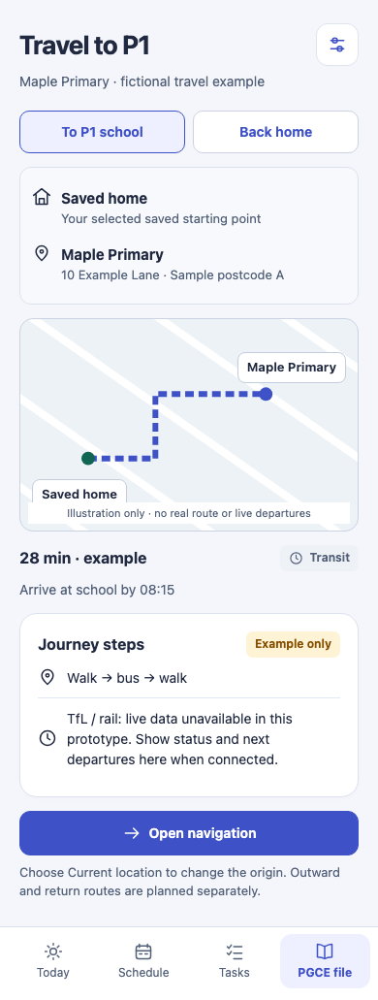

Open the selected placement's **To school** view with its school destination and the relevant session/date. The starting point is the user's chosen home, saved place or explicitly requested device location. Clearly display **From → To**, arrival time, buffer and transport mode before the result. Use that placement's school start/arrival preference; do not reuse P1's working day for P2.

Preserve the existing map, journey alternatives/steps, walking legs, supported TfL/train status and departures, arrival buffer, copy address and external navigation. They must remain visible or reachable in an explicitly labelled disclosure. Do not replace the map or train/TfL view with only a Directions link. Existing unsupported-provider/offline fallbacks still apply.

The mockups show an **illustrative route and example duration**, explicitly labelled as non-live. They do not establish a real route to the fictional schools. Production must render only actual provider results or clearly labelled estimates. Never display a made-up train departure, route or journey time.

#### Travel from the selected school to home

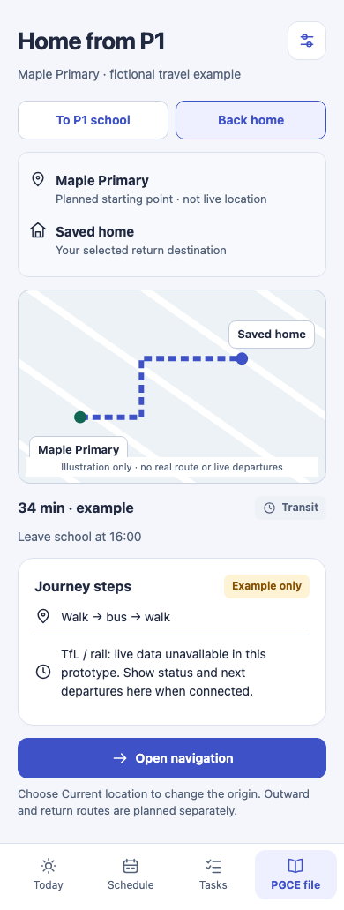

Provide **Back home** beside To school on the placement page and within the journey page. The planned origin is that placement's school and the destination is the selected saved home/return address. Label school origin as **Planned starting point**, not “Your location”; the app does not know where the user currently is unless they explicitly use a fresh device fix.

Plan the return journey separately using the chosen departure date/time or school finish time. Do not reverse the outbound polyline, assume symmetric travel times or reuse morning departures. Let users change the origin to Current location and the destination to another saved place. If no home exists, offer Set return destination without changing the school record.

The prototype supports [P2 outward](designs/journey-p2-out.html), [P2 return](designs/journey-p2-back.html), [P3 outward](designs/journey-p3-out.html) and [P3 return](designs/journey-p3-back.html) with the corresponding school visibly selected. Where a placement is not yet active, show that this is a planned journey for the selected future date, not a suggestion to travel there today.

#### Linking, ownership and migration contract

Add a first-class `Placement` entity: `id`, `profileId`, `code`, `schoolLocationId`, date range, mapped source-block IDs, mentor/contact references, working-pattern overrides, arrival preferences, optional saved return-place reference, revision and timestamps. Keep the school's location revision separate from the placement's teaching records.

- Lessons, observations, meetings, actual experience logs and practice attempts carry a stable `placementId` when school-specific. New school-specific records require a placement choice or an explicit **Unassigned** state; do not silently default them to P1.
- Course-level assignments and targets may remain course-owned. A target or evidence narrative can span placements through explicit references, while each underlying lesson/attempt retains its original school. Show which placements contribute; do not duplicate the source records.
- Attendance and placement exceptions retain original event ownership and source identities. Add placement association without replacing stable session keys. Same-day activities across settings need an explicit overlap/double-count check, not forced reassignment.
- Journal, Find, stats, binder, review packs, sync, local/cloud backup and restore preserve placement identity and display grouping. All-placement totals deduplicate canonical activity; per-placement totals must reconcile with the grouped view.
- Migrate existing tag-based school details with a **reviewable mapping**. Keep ambiguous records in Unassigned with their original tags and fields intact. Never guess the mapping from alphabetical order, first seen date, `SE1`-like strings or the current school name alone. No existing school address, notes, attendance or evidence should be lost.
- A school change invalidates only affected future journey results/leave plans and requests review of linked future events. It must not rewrite the historical school context of an old observation or exported review pack.
- Deleting/archiving a placement cannot cascade-delete linked records. Block deletion until links are reassigned or archived with their history; ordinary finished placements remain readable.

Journey cache/request identity includes profile, placement ID, school location revision, direction, actual origin/destination, mode and requested time. Ignore late P1 responses after the user switches to P2. Dated reminders resolve placement from the actual session mapping, not a global “currently viewed placement” preference. Run the corresponding worker/reminder compatibility review when changing that resolution.

#### Acceptance scenarios

1. Configure P1/P2/P3 at three different synthetic schools, with different mentors, hours and coordinates. Edit P2: P1 and P3 remain byte-for-byte unchanged except genuinely shared course settings.
2. Open a P2 lesson from Schedule, Find, the journal and a mentor action: each shows P2's school and returns to the correct context.
3. Select P3 while a P1 journey request is pending: a late response cannot display P1's route under P3.
4. Outbound P2 routes **chosen origin → P2 school**; return routes **P2 school → chosen home**, with separate times/results. Choosing Current location changes only the origin requested for that journey.
5. No home, no school coordinates, denied/stale device location, map failure, unavailable TfL/train data and offline each have explicit recovery/fallback states. No route result is fabricated.
6. Next week's P2 preview does not alter today's P1 leave reminder or automatically activate P2. Overlapping/ambiguous dates require the session's confirmed mapping or an explicit choice.
7. Legacy unmapped blocks retain data; mapping preview/confirm/cancel works; repeated migration is idempotent; source refresh does not create new copies of the same school or unlink existing records.
8. Local/cloud backup round-trips all three placements, links and overrides; restoring P2 does not replace P1's school details. Define scope preview clearly if per-placement backup is later offered—existing profile-scoped backup does not automatically become placement-scoped.
9. Map, TfL/train departures, journey steps and navigation remain usable for all three schools in both directions. Keyboard and 320px layouts clearly identify the selected placement.

## 12. PG-08 — Sustainable workload and support planning

**Outcome:** “I can see when the work will not fit and make a deliberate decision before it becomes urgent.”

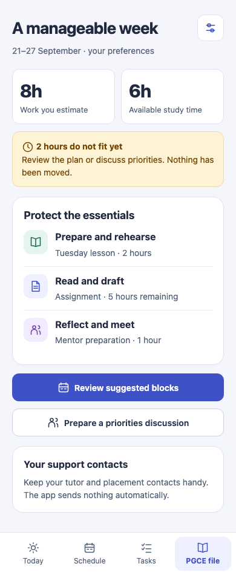

This specialises **MF-01** for trainees: lesson preparation, rehearsal, mentor preparation, reading, assignment drafting and reflection share one planning model. Ask for remaining effort and working preferences only where useful. Respect placement commitments, travel buffers, protected time, fixed deadlines and locked blocks. The initial engine should be deterministic and explain constraints.

If eight hours of work must fit into six available hours, report two unallocated hours. Do not fill protected time automatically or silently decide which course requirement to abandon. Offer reviewed block suggestions, deliberate scope/date changes and a prepared priorities discussion. Replanning produces a diff, requires acceptance and supports undo. “Review suggested blocks” in the static prototype is a concept, not a working scheduling engine.

Keep support practical: user-entered tutor/mentor/provider contact links, a personal discussion agenda and a list of unanswered course questions. No diagnostic wellbeing score, mood surveillance, student-risk prediction or automatic notification to staff. Optional private capacity notes remain excluded from ordinary review packs. A pause or missed reflection should not break a punitive streak.

**UI:** needed versus available time, the few tasks driving the gap and one planning action. Avoid arbitrary productivity scores, competitive leaderboards or pushing late-night catch-up. Default suggestions should be adjustable and never imply provider agreement to an extension.

**Acceptance:** preserves locked sessions and travel; unavailable time stays unavailable; missing estimates are marked unknown; cannot schedule an impossible block; changing a source deadline recomputes a proposal without auto-accepting it; undo restores the old plan; no message is sent from a support prompt without explicit user action.

## 13. PG-09 — Progress reviews and transition to the first teaching post

**Outcome:** “I can prepare a focused review and carry forward useful development information without treating my personal app as the awarding body.”

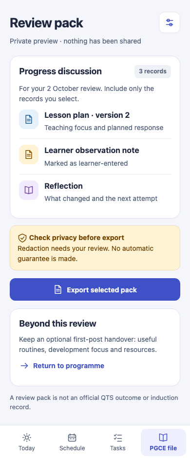

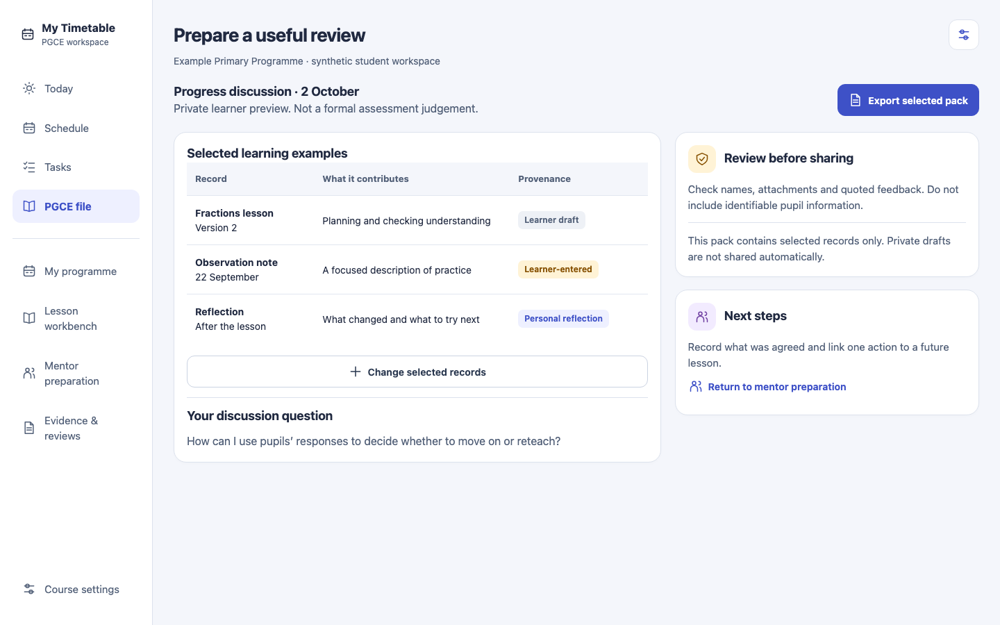

Combine the selected narrative/evidence, current practice focus, relevant experience summary and student questions into a review workspace. Its contents are selected for that review, not the entire journal by default. Record review date, participants, learner-entered notes, source of any provider judgement and agreed next steps. A missed meeting is not a failed assessment; a completed agenda is not a passed review.

Official outcome records are manually recorded references or, in a later authenticated provider integration, provider-supplied data. Show provenance and date. The app never awards QTS. Do not derive professional outcome from academic grades, attendance or the number of tags. Formal judgement fields remain unknown until an appropriate source is recorded, and “recorded by learner” stays visible where applicable.

After the student explicitly chooses to prepare a first-post handover, offer a minimal pack of useful resources, routines, feedback and ongoing development focus. It is optional and excludes private reflections and school/pupil identifiers by default. Starting employment or early-career induction is a new context, not an automatic extension of the PGCE progress calculation. Do not imply an induction body has received or accepted a personal export.

**UI:** preview selected records, distinguish their provenance and make one export/share decision. A later mentor/reviewer portal adds real access control; it should not be simulated by changing a badge to “verified”. Authenticated reviewers see selected packs only, not the student's full timetable or private journal.

**Acceptance:** selected pack matches output exactly; expired/revoked portal invitations fail when a portal is later added; legacy learner-entered observer names cannot become authenticated identities; source revisions are preserved; academic outcome cannot set QTS status; export creates no submission or external acceptance event.

## 14. Data model and implementation contract

### One record, many linked uses

Do not create independent copies of a lesson in the planner, journal and mentor view. Introduce stable typed references `{ profileId, entityType, entityId, revision? }`. Titles and dates are display metadata, never relational keys. Preserve existing event/session identity for timetable links. Profile ownership is checked on every read/write and export selection.

Proposed additions, names illustrative but responsibilities fixed:

| Entity | Required information | Important invariant |
|---|---|---|
| CourseProfile | Route, jurisdiction, academic year, provider label, dates, phase/subject | No inferred qualification or route |
| ProgrammePack / Requirement | Version, source, applicability, rule/description, confirmation provenance | Unconfirmed rules cannot produce compliance scores |
| ProgrammeMilestone | Kind, date, source reference, state, pack version | Academic and professional paths stay distinct |
| Lesson extension | Plan fields, sequence reference, timetable occurrence, version, review | Planning history and outcome are not overwritten together |
| PracticeCycle / Attempt | Focus, linked curriculum, rehearsal, lesson/feedback references, next step | Action done does not mean standard met |
| FeedbackRecord | Text, author/source type, created/reviewed time, linked record revision | Learner-entered never equals authenticated reviewer |
| KnowledgeGoal | Topic, self-rating events, sources, application/revisit references | Confidence is not formal assessment |
| AcademicProject | Brief, criteria, milestone/task references, submission/feedback provenance | Export is not submission |
| EvidenceExample / ReviewPack | Source references, narrative, selected pinned revisions, visibility | Removing a link does not delete source evidence |
| Placement | Stable P1/P2/P3 identity, separate school, source-block mappings, mentors, dates and overrides | No cross-school overwrites or guessed tag mapping |
| ExperienceLog | Placement ID, activity, date/duration, planned source, logged/reviewed provenance | No double-counted time or inferred attendance |

Every new persisted record needs stable ID, profile owner, timestamps/revision, schema version, optional-field defaults and compatible deletion semantics. Do not overwrite old records to force them into richer fields. Old observations acquire `sourceType: learner-entered` unless there is actual stronger provenance; historical unknowns stay unknown.

### Storage, sync and backup

The existing AdminFile, `shared/contracts.js`, `shared/merge.js`, storage/backup and worker payload paths are coupled. Adding a collection only to a React editor will not make it safely sync or restore. For every new field/collection, review local loading, validation, merge/tombstones, export, restore, cloud stripping and supported older-client behaviour together. Plan schema compatibility and worker-first rollout where the shared contract changes. Do not invent a new encryption format.

The shared example/feedback/reference structures should remain small; large documents belong in existing attachment mechanisms or a deliberately designed extension. Do not place full file blobs into ordinary synced metadata. Maintain explicit local-only/missing/uploaded attachment states. The first local features must remain useful offline; optional portal sharing requires an independently designed authenticated backend and revocable permissions, separate from analytics storage and device sync codes.

Historical review packs need immutable snapshots or pinned revisions plus durable retention of their referenced content. Choose and document one mechanism before release; a pointer to “whatever the lesson looks like today” is insufficient. Do not promise full restoration of externally held files that the backup does not include.

### Privacy, authorship and AI boundaries

No learner-risk scoring in admin analytics, no new telemetry without a separate collection decision, and no automatic sharing with mentors/providers. A named observer does not create an account. Pupil incident logs, identifiable work samples and safeguarding case management are outside this scope; link to the school's approved processes instead of duplicating them.

AI is optional later: finding material in selected sources, suggesting planning questions or summarising the student's selected notes with provenance. The core programme, lesson and practice cycle must work without it. Generated material stays a draft; no automatic grading, invented observation, fabricated evidence, guaranteed anonymisation or qualification prediction. Uploaded source text is content, not instructions to perform actions. External model use requires an explicit content-selection boundary, provider configuration and usage limits.

## 15. UI specification for Claude

Reuse the active visual audit's components and tokens. The mockups deliberately keep indigo actions, pale neutral surfaces, teal learning/activity accents, violet mentor context and blue academic/resource context. Amber identifies an unresolved decision or unknown input; it must not label an early-stage trainee as failing. Colour always appears with text/icon meaning.

- Main reading text 16px/24px; supporting copy at least 14px/20px; page headings 26–28px. Use 12–13px only for brief secondary labels.
- Mobile gutters 16–20px, card padding 16–18px, section gap 20–24px, controls at least 44px in interactive height. Icons around 20px with a visible label where meaning is ambiguous.
- One primary next action per section. Planning, review and sharing use separate confirmation steps. Important errors do not hide in collapsed panels.
- The prototype cards sometimes summarise forms as static panels; implement real labelled inputs, not content-editable text blocks with unclear save behaviour. Stage tabs need proper keyboard and selection semantics.
- Defaults should reduce effort: preload the selected lesson/placement context, carry existing source links, allow optional prompts, and save drafts. Do not prefill outcomes or imply feedback was received.
- Empty: explain what to add and why. Unknown: name the missing source. Offline: show available versus unavailable content. Pending save: keep retry/recovery visible. Conflicting edits: preserve both versions for resolution.
- Keep the four bottom destinations. The prototype links jump between conceptual pages; production must preserve existing route and Back semantics. P1/P2/P3 selection scopes school records and both journey directions; it does not silently change another session’s placement. New subroutes should be registered deliberately, with deep-link recovery and focus handling.
- Preserve maps, TfL, journey home and all existing record editors. A new teaching workbench is an additional linked surface, not a substitute for the current session Travel & map tab.
- Use the existing dark-theme token variants and test them; these new mockups show light-theme layouts only. Do not claim dark compliance from their colours alone.

The artwork uses **23 mobile layouts at 390px and 4 desktop layouts at 1440px**; capture heights expand to fit the proposed content. Mobile layouts were additionally checked for horizontal overflow at 320px. This is visual QA, not a complete accessibility audit. The gallery and dashboard-to-coaching link were exercised in the renderer. Source and QA outputs are supplied.

## 16. Suggested development sequence

| Batch | Deliverable | Dependency / gate |
|---|---|---|
| G0 | Reconcile with active V0–V5, define P1/P2/P3 placement identities and tag migration alongside other entities/provenance | Preserve current app functionality; tests for backward compatibility |
| G1 | PG-01 roadmap + PG-07A separate school setup/linking/travel + PG-02 lessons + PG-03 local practice/mentor preparation | One full lesson → feedback → next attempt cycle works offline |
| G2 | PG-04 topic goals + PG-05 academic workspace + PG-08 workload integration | Shared tasks/resources; no double scheduling or duplicate records |
| G3 | PG-06 selected narratives + PG-07 experience ledger + PG-09 review/transition exports | Correct provenance, source-version retention and exact export previews |
| G4 | Optional authenticated mentor portal and provider adapters | Separate permissions, review/revocation tests and authorised service setup |

G1 should be a coherent vertical slice, not all fields in every feature. Initial scope: one manual programme pack, one linked lesson, one practice focus, one learner-entered feedback note, one next action and a local review preview. Keep existing quick forms available. Later batches can expand the workflows without forcing portal accounts or AI subscriptions.

This sequence refines MF-01/02/03/05 from the earlier roadmap. MF-04 calendar integration, MF-06 collaborative coursework and MF-07 change-impact remain optional adjacent work, not prerequisites for a useful student-development cycle. Do not create duplicate assignment, resource, planning or review entities under different feature names.

No implementation begins merely because a proposal appears here. The user's current request is audit/documentation. When development is requested, implement only the chosen batch and follow current AGENTS/release instructions.

## 17. Acceptance and student validation

### End-to-end fixture

Use the synthetic programme in the mockups: a primary trainee plans a fractions lesson, rehearses a check for understanding, records a learner account of observation feedback, updates a next attempt, prepares a mentor agenda and exports a three-record pack. The assignment has a separate academic deadline. P1, P2 and P3 use three different synthetic schools. For P1, twelve placement days are planned and eleven learner-logged; one date is unconfirmed. Eight estimated study hours compete for six available hours.

Required outcomes:

1. The same lesson and action identities appear throughout; no duplicate records or reminders.
2. No stage change creates formal assessment, provider confirmation or attendance automatically.
3. The student can complete the cycle offline after loading the required content; unavailable attachments remain labelled.
4. The exported pack includes exactly three selected revisions with honest provenance and excludes private capacity notes.
5. The workload gap remains two hours until the student changes the accepted plan; protected time is not silently consumed.
6. Course rules remain unconfirmed until a source is supplied; no qualification percentage appears.
7. Existing maps/TfL, personal commitments, search, sync and backups remain reachable and correct.

### Technical gates

For each additive schema: old payload migration, malformed reference rejection, profile isolation, merge conflict/tombstone behaviour, unknown newer fields, export/restore round-trip and cloud-backup round-trip. Test interrupted saves and storage quota failure with recoverable drafts. If a portal is later built, test access denial, expiry, revocation, invitation scope and stale responses after sign-out using synthetic users only.

Run normal build/unit/browser validation on the latest implementation, both hosting bases as required by the active development plan. This audit does not rerun the production application suite during concurrent development and makes no claim about its current pass/fail state. Only the proposed HTML/screens and links were rendered and checked.

### Validate usefulness with students before broad rollout

Use consenting trainees and a mentor/tutor to test synthetic tasks; this audit did not conduct those sessions. Include primary/secondary and full-/part-time viewpoints. Ask participants to find the next learning action, prepare a lesson, distinguish academic and professional status, and preview a review pack. Observe whether they can explain what is private and what a “logged” experience means.

Success signals should be task success, less duplicate entry, clear provenance and usable next actions. Do not optimise for time spent in app, number of evidence uploads or reflection streaks. Suggested usability targets: find the next action within 30 seconds and prepare a pack from existing records in under three minutes after familiarisation; these are targets to test, not measured results. Revise the workflow if users feel it adds compulsory paperwork.

## 18. Handoff, sources and completion cleanup

The governing source links are attached to the factual distinctions in section 2. They were checked on 10 September 2026. Revalidate official guidance for the student's academic year before distributing programme templates. The feature designs are original proposals derived from the source-code review; they are not DfE-endorsed software requirements.

Files supplied:

- `PGCE_QTS_STUDENT_EXPERIENCE_AUDIT.md` — this feature and implementation handoff.
- `designs/gallery.html` — visual index of every screen.
- `designs/*.html`, `designs/design.css` — inspectable proposed UI; selected navigation links are functional.
- `designs/*.png` — screen images embedded in this document.
- `evidence/baseline.json` — source baseline and working-tree context.
- `evidence/render-qa.json` — rendering, overflow and script-error checks.
- `evidence/placement-navigation-qa.json` — P1/P2/P3 selection, outward/return journey and separate school-setup navigation checks.
- `evidence/add_placement_mockups.py` — regenerates the base concepts plus separate P1/P2/P3 school and travel concepts.
- `evidence/build_mockups.py`, `evidence/render_mockups.mjs` — audit-generation source; these reference the local design/runtime environment and are not app source.

**On completion of the implemented enhancement batch, move its finished specs, mockups, screenshots and temporary audit assets into `archive/enhancements/<date>-pgce-student-experience/` to keep the project clean.** Include this document when all its active work has moved to completion records or a clearly linked active backlog. Preserve relative links, add an archive README, and update PLAN/the documentation index.

Do not archive the visual implementation's active files, unfinished proposals, production code/assets, permanent regression tests, user records or another developer's working changes. New runtime features stay in their normal application directories. The archive step happens after development and verification, not during this audit.
