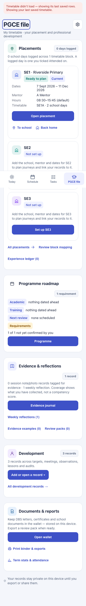
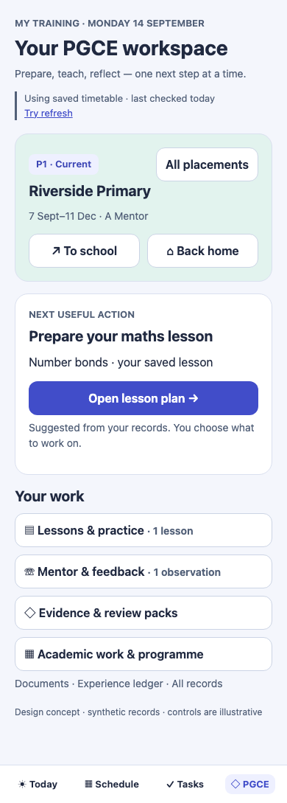
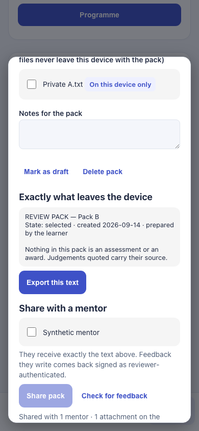
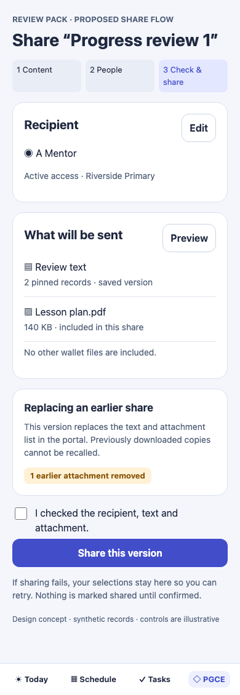
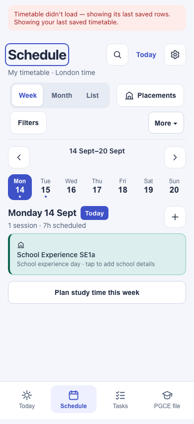
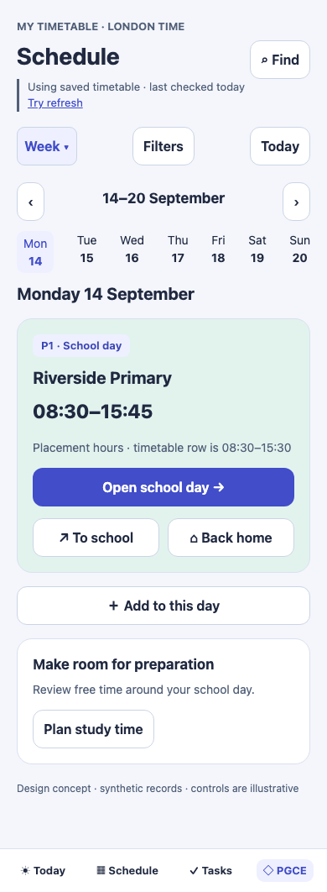

# My Timetable — current project audit and Claude implementation handoff

**Audit date:** 13 September 2026. **Baseline:** `71a65d1` (Pass 75 released; clean working tree when inspected). **Status:** recommendations only; no application code changed. **Owner:** student timetable, PGCE/QTS training and linked mentor experience. **Implementation order:** A → B → C → D below.

This is a fresh audit of the current implementation, not a request to rebuild features already delivered. G0–G4, separate placement workspaces, lessons, academic projects, evidence examples, workload planning, review packs, mentor access, key-date deduplication and completed-task reveal now exist. Preserve them. Read `AGENTS.md` before development and re-check the baseline if newer work has landed.

The most urgent findings concern **which attachments leave the device, re-sharing previously shared packs, and the two competing stores for placement school details**. Resolve these before adding another large feature set.

## 1. Scope, evidence and limits

Reviewed current React screens, schedule projection, placement journey and session wiring, review packs, wallet identity, mentor client/portal/worker, persistence and sync boundaries, recent release notes and existing tests. Captured current Today, Schedule, Tasks and PGCE screens with synthetic data at 390px and the PGCE page at 320px. This is a targeted source and local runtime audit, not a claim that every path, device or production service is defect-free. Admin analytics, live transport, Google Drive/iCloud integrations, service-worker upgrades and real-device Safari were not exercised in this pass. No real user records, production analytics or push subscriptions were accessed.

Validation performed on a separate local snapshot:

| Check | Result | Meaning |
|---|---|---|
| `npm run build` | Passed | TypeScript and production bundle built |
| Existing `npm run test:unit` | 194 passed | Existing unit baseline remains green |
| Audit browser probes | 5 passed | Tests **assert current defects**, not corrected behaviour |
| Audit mentor-worker probe | 1 passed | Reproduces stale/duplicate shared attachments and decryption failure |
| Mobile concept checks | See `evidence/design-qa.json` | 390px and 320px overflow checks |

The full existing 169-browser release suite was **not** rerun. Production remains untouched. The local browser fixture blocks all non-local requests; the saved-timetable warning in screenshots is a deliberate consequence of this isolation. Blue heading outlines are focus indicators and must not be removed as a cosmetic “fix”. Screenshots use synthetic records; route dates are fixed to 14 September for reproducibility.

Evidence: [browser log](evidence/browser.log), [worker reproduction](evidence/worker-repro.log), [unit log](evidence/unit.log), [build log](evidence/build.log), [browser probes](evidence/audit-sept13.spec.ts), [worker probe](evidence/audit-sept13.test.mjs). To replay, copy the browser probe to `tests/` and worker probe to `tests/unit/` in an isolated checkout; they use existing `tests/fixtures.ts` and source-relative imports. Create sibling `../handoff/visuals/` for screenshots or change those output paths. Run the existing build first, then the named probes. Do not commit defect-asserting probes as permanent success gates: turn their assertions into the required corrected behaviour.

## 2. Priority register

P1 = address before expanding sharing or releasing related changes; P2 = next usability/reliability batch; P3 = planned enhancement. “Reproduced” means a synthetic runtime/protocol probe observed it. “Source-confirmed” means the relevant implementation path was inspected, but no end-to-end reproduction was run for that exact case.

| ID | Priority | Finding | Evidence class |
|---|---|---|---|
| B01 | P1 | Switching review packs retains selections and can upload another pack's attachment | Reproduced |
| B02 | P1 | Re-sharing retains omitted attachments; repeated IDs break decryption | Reproduced in worker stand-in |
| B03 | P1 | Review-pack attachment references use device-local numeric IDs | Source-confirmed |
| B04 | P1 | Canonical placement setup and Schedule/session school settings diverge | UI observed + source-confirmed |
| B05 | P2 | Network failure leaves mentor sign-in disabled without feedback | Reproduced |
| B06 | P2 | Failed mentor-list loading remains “Loading your mentors…” | Reproduced |
| B07 | P2 | External placement navigation omits the selected journey origin | Source-confirmed |
| B08 | P2 | Mentor “off on this device” discards the management credential, with sync ambiguity | Source-confirmed; multi-device reproduction required |
| B09 | P2 | Date/title-only deduplication can hide genuinely distinct events | Source-confirmed collision scenario |
| B10 | P2 | Deleting a local pack does not withdraw its portal share | Source-confirmed; missing lifecycle control |
| U01–U05 | P2 | Findability, long forms, readability and accessible states | UI review / design recommendations |
| E01–E05 | P3 | Larger connected workflows | New feature proposals |

## 3. Bugs and implementation contracts

### B01 — isolate every review-pack draft and outbound share

**Where:** `src/components/ReviewPackSheet.tsx`, component states `picked`, `shareWith`, `shareAtt`, pack-selection buttons and share handler.

**Reproduce:** create Pack A with a wallet attachment and Pack B without one. In A select a mentor and the attachment. Select B, whose attachment selector is absent, then Share pack. The captured synthetic request contains B's text and A's attachment. Ordinary record selection also carries between packs: select a lesson in B, switch to A, Pin selection adds it to A. These are not merely confusing badges: the first case crosses the user's selected content boundary.

**Required change:** scope transient editor state to `{profileId, packId}`; on a context switch restore only that pack's own draft or reset it. Derive selected file objects from the **current pack's** attachment references intersected with validated wallet identities and explicit current-share selections. Never iterate arbitrary stale `shareAtt` IDs against the entire wallet. Capture an immutable command with pack identity, revision, recipients and validated attachment references when confirming; block or require a fresh review if those inputs change before submission. Reset status messages on context change. Do not automatically share any file.

**Acceptance:** A→B clears A's picks, recipients and attachments; B's outgoing body cannot include a file absent from B. Removing a selected file before Share excludes it and announces the change. Switching profile cannot retain either selection or status. Back within the same pack may retain that pack's draft. UI tests assert exact request body with synthetic files.

### B02 — replacement semantics and versioned encrypted attachments

**Where:** `workers/push/mentor-store.js`, `/mentor/share` and `/mentor/attachment`; `src/lib/mentor.ts` encrypts with a fresh key for each share.

**Reproduce:** share attachment `att1`; share the same pack with no attachments: `att1` remains. Share `att1` again: metadata appends a second entry, while KV overwrites `matt:<space>:<pack>:att1` with new ciphertext. `/mentor/attachment` uses the **first** metadata match, returning the old key and new ciphertext. Decryption fails. The cap of five applies only to each incoming request; accumulated metadata can exceed it. An old attachment also becomes available to newly selected recipients because the new recipient list applies to retained attachments.

**Required semantics:** the confirmed share is the complete replacement of that pack's portal content and recipient/attachment list. Show a diff before replacing: text updated, recipients added/removed, files added/removed. Use stable attachment identity plus immutable share revision in ciphertext keys. Validate the complete manifest before writing. Upload new ciphertext, then atomically commit the DO manifest referencing those versioned keys; failed attempts leave the old manifest valid. Make retry commands idempotent; do not append duplicate manifests. The DO transaction and KV writes are not one atomic transaction, so use version isolation, not an overwrite-and-rollback assumption. Existing TTL can reclaim orphaned task-created uploads; do not activate broad deletion or touch unrelated KV records.

**Acceptance:** replace with zero files yields zero accessible files for that share; repeat/retry yields one decryptable file; five is a total bound; old recipients lose portal access to the replaced pack; new recipients see exactly the newly approved manifest. Inject upload and DO-commit failures and prove the prior share remains readable. Previously downloaded copies cannot be recalled; say so plainly.

### B03 — use stable wallet identity across restore and sync

**Where:** `ReviewPackSheet.tsx` maps wallet entries with `String(f.id)` and tests presence by that value. `src/lib/attachments.ts` uses auto-increment IndexedDB IDs and already supplies `uid` / `attachmentUid`. `src/lib/wallet.ts::prepareWallet` allocates local numeric IDs during import.

**Problem:** a synced pack's `id: "1"` may identify a different file on another device. It can falsely display “On this device only” for the original file name, then share the other file's bytes. Restoring into an existing wallet may renumber files, breaking links even when the correct bytes are available. This exact cross-device flow was not executed in this audit; the identity mismatch is explicit in source.

**Fix:** store `attachmentUid` plus owning profile, display name, size and an optional validated content digest in pack references. Numeric IDs remain local database handles only. Resolve by stable identity, never by filename, list position or numeric-ID coincidence. Extend wire validation and schema migration. For legacy references, offer explicit relinking if identity cannot be established; “Missing — choose the original file” is preferable to silently choosing. Backups must preserve stable references and UID; mentor attachment IDs may need a safe encoded/hash representation because the current worker validates record IDs. Test this contract end to end instead of passing arbitrary UUID strings blindly.

**Acceptance:** two devices both having wallet row 1 but different files never resolve to each other's attachment; merged restore with remapped local IDs still resolves stable UIDs; missing files remain missing; users can relink after previewing name/size; profile isolation holds. B01–B03 ship as one coherent sharing correctness batch.

### B04 — one source of truth for school setup everywhere

**Where:** `src/App.tsx` supplies `SessionDetail.placementInfo` from `settings.placements[tag]` and writes edits back there. `src/features/schedule/DayList.tsx` reads the legacy map. PGCE's placement chooser/workspace reads `admin.placements` and `admin.schools`.

**Observed:** the synthetic PGCE page displays Riverside Primary as ready/current, while Schedule says “School experience day · tap to add school details”. The session detail can similarly read and edit a separate school record. A school-name label from the canonical entity does not fix stale coordinates underneath it.

**Fix:** centralise `resolvePlacementForSession(session, admin, settings)` with the confirmed block mapping → placement ID → school ID as canonical path. Return school, mentor, coordinates, working hours, setup state and provenance together. Adapt the legacy input shape at the UI boundary temporarily, not as a second owner. Route school edits to the canonical setup workflow; use legacy data only for unmigrated blocks with a visible migration/review state. Review SessionDetail travel, Schedule, Today, reminders and exports for the same split. If worker reminder payloads still need the legacy shape, project it from canonical data explicitly when building the payload.

**Acceptance:** editing P2's school updates its chooser, all mapped session details, school-day cards and relevant travel payloads after reload/sync, and changes nothing in P1/P3. Legacy-only profiles remain usable; ambiguous mappings request review. Schedule displays the same school as its workspace. Keep imported session time and placement working hours distinguishable; do not silently rewrite imported rows. Owner-facing names can be P1/P2/P3 while source tags remain SE1A etc.; don't rename persistent IDs or erase source tags just for display.

### B05 — recover mentor operations after fetch rejection

**Where:** `src/mentor-portal/MentorApp.tsx`, `join`, `login`, `send`, `load`, `download`.

**Reproduce:** abort `/mentor/login`, then submit a passphrase. An unhandled rejection occurs; busy never resets and no alert appears. Similar functions await fetch/decryption without a shared try/catch/finally boundary.

**Fix:** explicit operation status, bounded request timeout/abort, `finally` cleanup, actionable error and Retry. Preserve feedback draft on failed submission. Associate responses with current session/space, discard late results after sign-out or route changes. Treat 401 as expired authentication, 403 as access ended, network failure as connection failure and decryption failure as an attachment error. Never say feedback was delivered to the learner's app merely because it reached the server: use “Feedback saved. The learner can collect it in their app.” Implement idempotent feedback submission before offering retries after uncertain outcomes.

**Acceptance:** reject fetch for login/join/send/list/download, and reject decryption; no unhandled errors, no permanently disabled actions, a named Retry is available, draft survives. A response from an old session cannot replace the new session's packs. Check keyboard submission through an actual form.

### B06 — loading, empty and error must be different states

**Where:** `ReviewPackSheet.tsx` mentor-list effect sets `mentors=null` in catch; rendering interprets null as loading. Effect depends only on `profileId` despite using mentor-space credentials/settings.

**Fix:** discriminated state `idle | loading | ready | error`, error text plus Retry, abort/stale-response guard, dependencies covering effective service and space identity. Keep “No active mentors” for a successful empty result only. Handle wallet-load failure separately from a genuinely empty wallet; currently it also becomes an empty array.

**Acceptance:** 503/network refusal produces an error and retry, not indefinite loading; no spinner after settled failure; changing space refreshes recipients; wallet storage denial doesn't claim no files exist. Announce transitions via one polite status region, errors via alert when user action fails.

### B07 — preserve planned origin in external navigation

**Where:** `src/features/pgce/PlacementJourneyPage.tsx` constructs `mapsUrl` with destination and travel mode but not the selected origin. Internal route map uses `origin.coords`.

**Fix:** when a saved school/home/place was selected, include its validated coordinates in the external route request through a shared URL builder. For live-device navigation, explicitly label “Navigate from my location” and document that it uses the device. Separate this from “Open planned route”. Do not display a planned school-origin return beside a button silently implying the same route while passing destination alone.

**Acceptance:** P1/P2/P3 outward and return links include the correct intended endpoints when planning from saved locations; unavailable coordinates disable planned-route action with a setup path; URL encoding and each supported mode covered by pure tests. Keep TfL steps, map, rail/status information and independent return planning intact. Real transport accuracy needs separate live-service verification.

### B08 — retain ownership while allowing mentor access to be paused

**Where:** `MentorAccessSection.tsx` clears `mentorSpaceId` and `mentorOwnerToken` under “Turn off on this device”. `shared/merge.js::deviceSettings` excludes neither field, and the space credential is intentionally synced.

**Problem:** on the sole device this abandons the management credential while mentors retain shared packs. Re-enable creates a new space, not a way to manage the old one. The copy understates the consequence. Multi-device propagation/restoration depends on merge timing and needs a dedicated test; do not claim a confirmed remote revocation bug.

**Fix:** keep the credential unless explicitly closing/recovering a space. Add a device-local `mentorAccessPaused` flag with truthful effect: stops fetching/sharing on this device but does not end access. Provide separate “Manage shared access” and “End mentor access” actions with recipient/pack impact preview. A service-side close-space operation, if implemented, must be owner-authorised and leave a recoverable audit status; never infer permission to bulk-delete stored data. Reconcile source-space selection on sync.

**Acceptance:** pause/unpause keeps the same space; sole device can still revoke; two-device tests cover pause, sync and restore; no credential appears in invitation text, screenshots, logs or exports intended for mentors.

### B09 — deduplicate representations without hiding distinct events

**Where:** `src/lib/scheduleProjection.ts::sameDayTitle`, `dedupeKeyDates`, `buildProjection`; `src/App.tsx::allKeyDates`.

**Collision:** two “Progress review” events on one day at different times/modules are collapsed by date/title alone. A genuine timed course session sharing that title with a deadline is removed from the calendar projection. This is a deterministic code scenario, not a report that the owner's current source contains it. Pass 74 solved real duplicate rows and must remain solved.

**Fix:** differentiate canonical event identity from display grouping. Group likely duplicates with provenance/expand affordance when uncertain. Only merge representations automatically when explicit source linkage or sufficiently matching event attributes justify it; retain differing times/locations and task completion owners. Display one highlighted deadline where equivalence is known without dropping unrelated lessons. Do not solve this by globally restoring all duplicate rows.

**Acceptance:** existing Pass 74 fixture still produces one deadline; same title/date with different times or modules remains accessible; a course session is not lost because a deadline shares its name; search and completion lead to the right canonical item; reminder behaviour is reviewed independently from presentation deduplication.

### B10 — distinguish local deletion, unsharing and retention

**Where:** `ReviewPackSheet.tsx` Delete pack removes the local collection entry only. Mentor worker exposes sharing/revocation but no individual unshare flow in the reviewed client.

**Fix:** label Delete local pack with a portal-share summary and offer a separate owner-authenticated Unshare action. Show recipients, last shared revision, attachment expiry and current portal state. Use idempotent unshare which denies subsequent portal access without pretending it removes downloaded copies. Keep private local record deletion separate from server retention decisions. Add undo or a reviewable confirmation to destructive pack/record deletion; the current reflections/pack delete controls immediately remove records.

**Acceptance:** deleting a shared local pack cannot silently imply portal withdrawal; unshare causes mentor refresh and attachment endpoints to deny access; failed unshare stays visibly pending/failed, never “removed”; local undo preserves source records and sync tombstone semantics.

## 4. UI changes: make the existing depth easier to use

Open the [before/after gallery](visuals/gallery.html). These are implementation references, not screenshots of completed enhancements. Screens use the same synthetic school context; “P1” in concepts is the proposed learner-facing label for the existing SE1 record. No third-party imagery or live map data is used.

### U01 — a useful PGCE landing page instead of a long feature directory

**Observed:** the 390px synthetic PGCE page is about 2,726 CSS pixels tall. Three placement cards dominate the first scroll. Programme, evidence, development and documents appear below. Development's “Add or open a record” menu has eleven choices; it mixes entire workspaces with record types. Useful existing academic, workload and practice tools are hard to discover.

**After:** show a compact active-placement card with school name, P1/P2/P3 state, All placements, To school and Back home. Show one next useful action with its reason, then four stable destinations: Lessons & practice; Mentor & feedback; Evidence & reviews; Academic work & programme. Keep Documents, Experience ledger and All records accessible beneath. Within All placements, preserve three separately configured schools and setup/current/upcoming states; collapsing their landing-page presentation must not merge their data.

Use existing `nextSteps` / attention selectors where suitable, with an explicit precedence rule: unresolved data/access issue → near dated commitment → unfinished recently edited work → empty-state onboarding. Only one recommendation in the main slot; provide See all. Never manufacture a competency score or make the learner feel behind because a requirement is unconfirmed. Preserve full access to all records independent of suggestions.

**Acceptance:** open the current lesson or mentor preparation in at most two actions from PGCE; navigate to P2 without altering active-session reminders; all existing eleven menu functions remain reachable via labelled destinations; empty profile has one setup action, not a screen of zero counters. Remember the last section per profile, not globally.

| Current implementation | Proposed structure |
|---|---|
|  |  |

### U02 — review packs as a staged editor with a final share summary

Current packs combine creation, pack list, an unbounded candidate list, captions, files, notes, state transitions, delete, text preview and sharing in one scrolling dialog. A long portfolio can bury the actual Share controls. The candidate list has no date/placement/type search. Copy says files “never leave this device with the pack”, while a later section supports uploading them; clarify the distinction.

Use a pack list/detail view (desktop split view; mobile full-screen detail) with three steps: **Content → People → Check & share**. Content has searchable candidates filtered by placement, date and record type, selected count and explicit Pin. Show a human-readable preview with headings; keep plain-text export matching that same underlying content. People shows active recipients and only the current pack's resolvable attachments. Check & share shows exact recipients, text revision, included files, total size and changes from the prior share. Primary button: “Share this version”; secondary: Back. Saving a private draft must not require choosing recipients.

Keep the current learner-selected states (Selected/Draft/Discussed) separate from sharing state (Never shared/Shared version/Changes not shared/Failed). Show the sharing state near the title. Notes edited after sharing must not imply they have already reached mentors. A selected identity is sticky only inside its pack, per B01.

**Acceptance:** at 320px no horizontal scrolling; with 200 candidate records, search/filter can find and pin one without traversing the entire list; keyboard focus enters headings/controls predictably; every share can be reviewed immediately before sending. Validate date fields before marking Discussed; an empty date should have an inline error. Test real keyboard/VoiceOver behaviour separately.

| Current share editor viewport | Proposed final share step |
|---|---|
|  |  |

### U03 — mobile schedule: clearer school context, fewer competing controls

The existing schedule already has a useful day strip and mobile Week view. Keep that. Its header currently divides controls across several rows and a school-day card omits configured school detail (B04). The daily schedule total uses imported time, while placement hours can be different: make that distinction legible rather than inventing one unified duration.

Use one compact toolbar (view selector, Filters, Today), one week navigator, and the date strip. Put Find beside the title, secondary actions in a clearly labelled menu. School-day card: **P1 · School day**, school name, working hours, explicit source/difference if necessary, Open school day, To school, Back home. Key dates remain highlighted ahead of timed sessions. General sessions keep time, title, room and conflict information. Keep Plan study time, but make it a secondary weekly action rather than another visually equal primary control.

**Acceptance:** the selected day and first session are visible at ordinary mobile size; large text reflows; filters display an active count and Clear; no action disappears at 320px; return navigation respects the selected school; out-of-date timetable status remains obvious with Retry and a checked time. Do not treat the audit's blocked-network warning as evidence of a production outage.

| Current mobile schedule | Proposed mobile schedule |
|---|---|
|  |  |

### U04 — consistent readable controls and accessible states

Reuse `src/index.css` semantic tokens and existing `src/components/ui.tsx` icons; do not introduce another icon library or independent styling system. Main app already has a stronger visual vocabulary than the newly added mentor portal.

| Element | Implementation target |
|---|---|
| Main text | 16px, line-height about 1.5; form controls inherit font |
| Supporting text | 14px minimum target for instructions, contrast checked against actual surface |
| Main heading | 28px/1.2 on mobile; section heading 20px/1.3; item title 17px |
| Layout | 16–20px mobile gutters, 8px spacing rhythm, 16–18px card padding/radius |
| Primary action | Indigo, one per task region; full-width only where it improves mobile flow |
| Semantic colour | Teal school/saved, violet development, amber action needed, red failed/destructive; always pair colour with text/icon |
| Interaction | Aim for at least 44px targets; preserve focus outlines; actual button/link semantics |
| Responsive editor | Full-screen route/detail on narrow phones; bounded side panel or split view on wide displays |
| Status | Explicit idle/loading/saved/error/offline; use status announcements without repeating every keystroke |

Mentor CSS currently sets dark-mode accent `#8fa4ff` and white primary-button text. Their computed contrast is approximately 2.4:1 (calculate in validation), so use a dark foreground on the light dark-mode accent or a darker accessible button fill. Error/success text colours also need dark-surface testing; `.mentor-error` and `.mentor-notice` currently remain fixed. This is a source colour finding, not a complete measured accessibility audit.

Do not remove underlines/focus rings to match a mockup. Use SVG icons from the shared UI system in implementation; the concepts' simple glyphs indicate icon purpose only. Label textarea fields visibly rather than relying solely on placeholders (for example the legacy reflection form). Tab widgets require arrow-key behaviour and associated panels, not only role attributes. Honour reduced motion, including completed-task reveal; keep the newly delivered completed-task confirmation/Undo.

### U05 — predictable record navigation and recovery

Add persistent URL destinations for the major PGCE workspaces rather than stacking large transient sheets. A record detail header should name type, placement and date; show local save state and a clear Back destination. Distinguish “Add new” from “Open existing”. Avoid a destructive icon immediately beside Edit without a label/undo. Empty states need one useful next action; loading failures must not look like empty records. Reuse existing draft/persistence facilities rather than constructing a second autosave framework.

**Acceptance:** refresh/deep link restores the selected record; browser Back returns to prior filter/scroll; closing with a failed save preserves recoverable input; screen-reader names identify the affected record; a deleted source keeps pinned review snapshots readable.

## 5. Larger enhancements that connect the existing features

These are product proposals, not bugs and not already implemented by this audit. Build on G0–G4; do not create parallel lesson/target/evidence stores. Defaults below are sufficient for Claude to implement a first version without provider APIs or additional owner decisions.

### E01 — a lesson-to-feedback workspace

**Outcome:** one visible thread from lesson preparation to taught lesson, observation, chosen improvement and next attempt. Existing lessons, practice cycles, mentor preparation and observations form the sources.

**Screen:** “This teaching cycle” with Plan → Teach → Feedback → Try next. Show the school/placement chip throughout; embed links to existing records and timestamps. The learner selects which observation informs which next lesson; never automatically convert mentor feedback into a new target or a judgement.

**Model:** a lightweight `learningThreads` collection with ID, profile ownership, placement ID, lesson IDs, observation IDs, cycle ID, chosen next-action text, state and revision/tombstones. Store references, not copies. Deletion leaves a “source no longer present” item, except existing pinned review snapshots. Explicitly handle cross-placement next attempts without changing the original record's placement.

**First release acceptance:** start from a lesson, attach existing feedback, create/open next practice lesson; reload/sync/backup round trip; one observation can inform multiple threads with no cloned feedback. Private learner reflection remains excluded from mentor share until deliberately included. A compact timeline at the top of the lesson workbench shows what is missing and why.

### E02 — a weekly review that proposes a realistic next week

**Outcome:** connect workload planning, academic tasks, placement hours, preparation and mentor actions into one reviewable weekly plan. Existing Workload & support already proposes time blocks; extend it rather than duplicate its planner.

**Screen:** This week: planned / logged / still open; Next week: fixed commitments and free slots; a preview showing moved, added and untouched study blocks. The learner accepts changes individually or as a batch. Include upcoming placement travel and protected time. No wellbeing or QTS score.

**Model:** store review ID, week, selected source references, learner reflection, proposal revision and accepted block IDs. Compute workload from canonical tasks and plans. Any imported timetable change invalidates stale proposals; recalculate and show a diff. User-edited blocks are protected unless explicitly selected.

**Acceptance:** a late finish at school reduces available time; missing effort remains unknown; accepting twice never duplicates blocks; Undo touches only that accepted batch; overnight/DST boundaries use the existing course calendar utilities. Offline operation must work from cached data and label travel assumptions.

### E03 — assignment workspace with submission evidence

**Outcome:** move beyond task milestones to a complete academic workflow: brief → question → reading → outline → draft → submitted → feedback → next action. Existing AcademicSheet/projects/readings and task links are the owners.

**Screen:** one assignment summary with due date, word-count target entered by learner, progress stage, linked sources, next task and “Record submission”. Show submission receipt/status as learner-recorded, not institution-verified.

**Model:** extend project with versioned outline sections, draft references (local wallet UID or external link), submission record `{submittedAt, channel, receiptAttachmentUid?, note}`, and feedback refs. Preserve academic milestone links to the canonical deadline; no LMS connection assumed. A source list stores title/URL/author/learner notes; do not generate fabricated citations.

**Acceptance:** changing an assignment deadline updates its linked planning view without creating duplicate pins; receipt survives backup/restore by stable UID; local receipt deletion shows missing; resubmission adds history rather than replacing evidence; submission never auto-completes all related tasks.

### E04 — placement transition and handover checklist

**Outcome:** help a learner move from P1 to P2 to P3 without carrying the wrong school, mentor, travel destination or access permissions forward.

**Screen:** three-school timeline → “Prepare for P2”; checklist groups School & travel, Teaching context, Mentor & access, Carry forward. Preview outward/return endpoints before the first school day. Suggest open goals to carry forward as references; old evidence stays attached to the original placement.

**Model:** transition record with from/to placement IDs, checklist state, reviewed school revision, reviewed mentor-share list, chosen target refs and learner-confirmed date. Mentor access changes remain explicit, separate commands. Store only learner-entered non-pupil context; avoid creating a pupil database.

**Acceptance:** finishing P1 doesn't erase its history; starting P2 can't overwrite P1 school fields; changed P2 coordinates invalidate the travel-review check; the user can revisit P1 safely; temporary accommodation can be an optional per-placement saved return destination with a clearly labelled global-home fallback.

### E05 — learner-controlled data and sharing centre

**Outcome:** one trustworthy view of On this device, Synced to my devices, Backed up, Shared with mentors. This extends current backup/sync/mentor functions rather than promising a new cloud provider integration.

**Screen:** four status cards with last confirmed result, scope and “Review details”. Record/file table answers where each item is stored, whether its backup includes bytes, which share revision includes it and when a remote attachment expires. Actions: review backup, test restore in isolated preview, manage share, fix missing file.

**Model:** reference existing backup manifests, stable attachment UIDs and authoritative portal-share summaries. Status must be derived from confirmed receipts, not merely button clicks. Restore preview shows adds/replaces/missing attachments before applying. Include an exportable plain-language recovery guide without exporting mentor/session secrets into mentor-facing material.

**Acceptance:** an offline attempted upload is never shown as backed up; text-only export isn't described as containing files; expired mentor attachments are obvious; restored local numeric IDs do not break links; an intentionally unshared file stays unshared. Cloud-provider-specific work requires current capability verification before implementation; do not label OS file-picker export as automatic cloud backup.

## 6. Delivery plan for Claude

| Batch | Work | Exit gate |
|---|---|---|
| A — correctness first | B01–B04; stable file identities, isolated pack state, versioned shares, canonical school resolver | Cross-pack and cross-device tests; reshare/failure injection; all school contexts agree |
| B — recovery and control | B05–B10; portal failure states, external origins, pause/management lifecycle, dedupe safety, unshare | Offline/error/retry tests; two-device credential tests; Pass 74 remains green |
| C — usability | U01–U05, using the concepts and existing tokens; no new primary nav destinations without need | 320/390/768/1440 widths, dark/light, 200% text, keyboard; school/pack flows in two actions where specified |
| D1 — connected teaching | E01 + E04 | Lesson thread and placement transition complete offline; records remain canonically owned |
| D2 — academic and weekly flow | E02 + E03 | No duplicate planning blocks/deadlines; submission evidence and undo tested |
| D3 — data confidence | E05 | Truthful confirmed state, restore preview, stable file/share identity |

For each batch: inspect latest code; mark each ID accepted/in progress/verified with commit and test evidence; implement the smallest coherent vertical slice; update contracts, migrations and fixtures together; test meaningful edge cases; update `PLAN.md` and the learner-facing changelog for releases. Do not claim a fix because a mock screenshot looks right. Convert audit probes into positive regression tests. Run `npm run validate` and the required Vercel build gate according to the runbook; worker changes require worker deployment before app release. This audit does not authorise deploying changes.

### Required regression matrix

- Profiles: empty, existing legacy placements, confirmed P1/P2/P3, missing school pin, unrelated second profile.
- Records: 0/1/200 candidates, long titles, missing source, deleted source with pinned copy, uncertain provider requirement.
- Sharing: two packs, two mentors, same attachment ID twice, changed bytes, missing UID, retry, stale response, revoked mentor, expired attachment, local deletion vs unshare.
- Dates: identical titles with different identities/times, source duplicates, all-day pins, DST and midnight course timezone, P2 preview while P1 is current.
- Devices: 320px narrow, 390px phone, 768px tablet, 1440px desktop; 200% text; dark/light; reduced motion; keyboard; real iOS Safari/PWA before claiming native mobile verification.
- Failure: offline, 401, 403, 503, malformed response, storage denial, failed encryption/decryption and failed commit after upload. No false success or irrecoverable form state.
- Keep separate: provider requirements vs learner plans, academic PGCE vs QTS award, logged vs assessed experience, curriculum framework vs final standards assessment, learner-entered vs authenticated feedback.

## 7. Handoff assets and clean-project completion rule

This folder is the complete audit package. `visuals/` contains actual before screenshots, three editable after HTML concepts, PNG exports and the side-by-side gallery. `evidence/` contains local verification logs and reproducible probes. Concepts are illustrative HTML, not application components; implement with the repository's own components and semantics.

**When every accepted enhancement in this handoff is implemented and verified, move all files related to this enhancement handoff—this Markdown, concepts, screenshots, audit-only probes, logs and temporary implementation plans—into `archive/enhancements/2026-09-13-project-audit/` within the project.** Add an archive README with delivered/deferred IDs, commits, validation results and links to replacement permanent documentation. Update references and `PLAN.md`. Move rather than duplicate or delete. Do not archive production source, permanent regression tests, active runbooks, unrelated work or credentials. If features are deferred, record them explicitly and retain a small active backlog link so archival does not imply they shipped. Never move another agent's active enhancement work as part of this cleanup.
